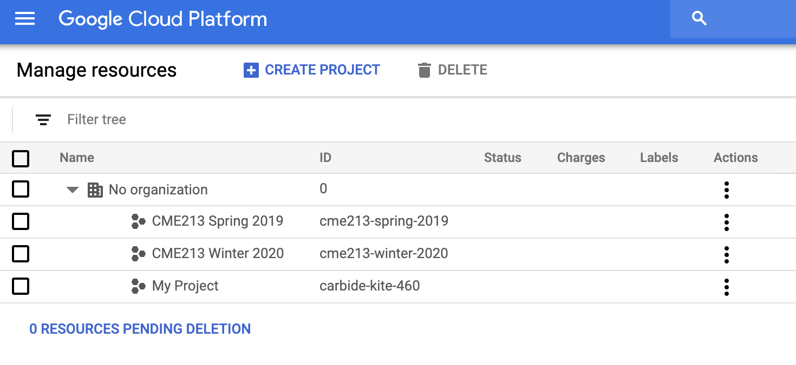
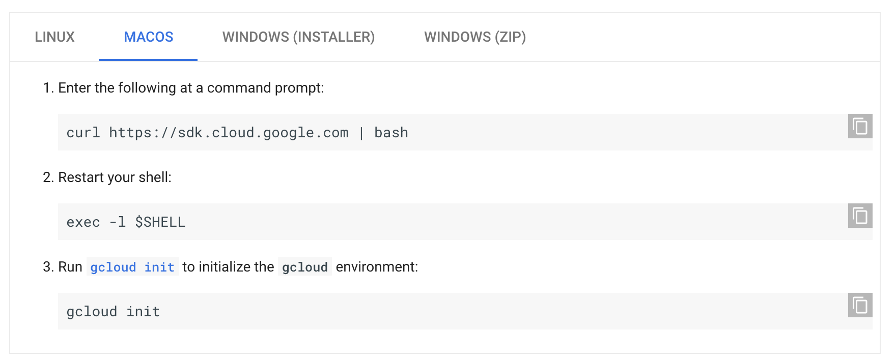
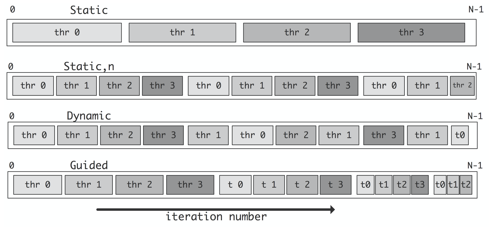

class: center, middle

# CME 213, ME 339 - Winter 2020

## Eric Darve, ICME


“Controlling complexity is the essence of computer programming.”
(Brian Kernigan)

---
class: center, middle

# Google Cloud Platform

Instructions for setup

https://stanford-cme213.github.io/gcp.html


---
class: middle

# Google Cloud Platform

To do:

1. **Do not** use a Stanford Google account (or G Suite account) 
2. Use a personal Google account
2. Redeem coupons sent by TAs

---
class: center, middle

# Setup

Set-up GCP project</br>https://console.cloud.google.com/cloud-resource-manager



---
class: center, middle

Install GCP SDK on your local machine</br>https://cloud.google.com/sdk/docs/downloads-interactive



---
class: middle

# Create a virtual machine

1. Download script</br>.compact[https://stanford-cme213.github.io/Code/create_vm_openmp.sh]
2. Run [./create_vm_openmp.sh](https://github.com/stanford-cme213/stanford-cme213.github.io/blob/master/Code/create_vm_openmp.sh)

Virtual machine:</br>hardware + operating system and software

---
class: middle

```
$ ./create_vm_openmp.sh 
Updated property [compute/zone].
Created [https://www.googleapis.com/compute/v1/projects/cme213-winter-2020/zones/us-west1-b/instances/omp].
NAME  ZONE        MACHINE_TYPE   PREEMPTIBLE  INTERNAL_IP  EXTERNAL_IP   STATUS
omp   us-west1-b  n1-highcpu-8               10.138.0.5   34.82.44.63  RUNNING
Installing necessary libraries. You will be able to log into the VM after several minutes with:
gcloud compute ssh omp
```

---
class: center, middle

# The omp VM

Runs Linux Ubuntu

8 cores

`make` & `g++` installed

---
class: middle

# Log in and copy files

Log in

`$ gcloud compute ssh omp`

Copy

`$ gcloud compute scp LOCAL_PATH omp:VM_PATH`

---
class: center, middle


More information on `ssh`, `scp`

https://cloud.google.com/compute/docs/gcloud-compute/

https://cloud.google.com/sdk/docs/quickstarts 

---
class: center, middle


---
class: center, middle

C++ threads are great for low-level multicore programming

But too general and complicated for engineering applications


---
class: middle

Two common scenarios

1. `For` loop: partition the loop into chunks</br>Have each thread process one chunk.
2. Hand-off a block of code to a separate thread

---
class: center, middle

OpenMP simplifies the programming significantly.

In many cases, adding one line is sufficient to make it run in parallel.

---
class: center, middle

OpenMP is the standard approach in scientific computing for multicore processors

---
class: center, middle

# What is OpenMP?

Application Programming Interface (API)

Jointly defined by a group of major computer hardware and software vendors

---
class: center, middle

Portable, scalable model for developers of shared memory parallel applications

Supports C/C++ and Fortran on a wide variety of computers

---
class: center, middle


OpenMP website</br>https://openmp.org 

Wikipedia</br>https://en.wikipedia.org/wiki/OpenMP

LLNL tutorial</br>https://computing.llnl.gov/tutorials/openMP/

---
class: center, middle


---
class: center, middle

The Parallel Universe

.compact[https://software.intel.com/sites/default/files/managed/6a/78/parallel_mag_issue18.pdf]

---
class: center, middle

# Compiling your code

Header file:

```
#include <omp.h>
```

---
class: center, middle

Compiler | Flag
--- | ---
gcc</br>g++</br>g77</br>gfortran | `-fopenmp`
icc</br>icpc</br>ifort | `-openmp`

---
class: center, middle

# Installation on macOS

---
class: center, middle

# Option 1: `libomp`

`$ brew install libomp`

Use the system compiler `/usr/bin/g++`

Compile with options

`-I/usr/local/include -Xpreprocessor -fopenmp`</br>`-L/usr/local/lib -lomp`

---
class: center, middle

# Option 2: `gcc`

`$ brew install gcc`

Compiler: `/usr/local/bin/g++-9`

Flag: `-fopenmp`

---
class: middle

Which version of openMP do you have?

This determines the set of features available

```
$ echo | cpp -I/usr/local/include -Xpreprocessor -fopenmp -dM | grep OPENMP 
#define _OPENMP 201107
$ echo | /usr/local/bin/cpp-9 -fopenmp -dM | grep OPENMP 
#define _OPENMP 201511
```

---

# Mapping

Year | OpenMP version
--- | ---
200505 | 2.5
200805 | 3.0
201107 | 3.1
201307 | 4.0
201511 | 4.5
201811 | 5.0

---
class: center, middle

# Parallel regions

---
class: center, middle

# `#pragma omp parallel`

This is the basic building block

This is not how OpenMP is used in most cases

Serves simply as an introduction


---
class: center, middle

`#pragma omp parallel`

The block of code that follows is executed 

by all threads in the team

---
class: center, middle


---
class: center, middle

This is called the

.red[fork-join model]

---
class: center, middle

# Computing $\pi$


[hello_world_openmp.cpp](https://github.com/stanford-cme213/stanford-cme213.github.io/blob/master/Code/Lecture_04/hello_world_openmp.cpp)

---
class: middle

```
#pragma omp parallel num_threads(nthreads)
{
    long tid = omp_get_thread_num();
    // Only thread 0 does this
    if (tid == 0)
    {
        int n_threads = omp_get_num_threads();
        printf("[info] Number of threads = %d\n", n_threads);
    }
    // Print the thread ID
    printf("Hello World from thread = %ld\n", tid);

    // Compute digits of pi
    DoWork(tid, ndigits[tid], etime[tid]);
}
// All threads join the master thread and terminate
```

---
class: middle

Choose your compiler in [Makefile](https://github.com/stanford-cme213/stanford-cme213.github.io/blob/master/Code/Lecture_04/Makefile)

`$ make`

`$ ./hello_world_openmp`

---

Sample output

    Let's compute pi =              3.1415926535897932384626433832795028841...
    [info] Number of threads = 8
    Hello World from thread = 0
    Thread  0 approximated Pi as     3141592653589793
    Hello World from thread = 1    
    Thread  1 approximated Pi as     314159265358979323846264
    ...
    Thread  7 approximated Pi as     31415926535897932384626433832795028841...
    Thread 0 computed 16 digits of pi in    67 musecs (   4.188 musec per digit)
    Thread 1 computed 24 digits of pi in    16 musecs (   0.667 musec per digit)
    ...
    Thread 7 computed 72 digits of pi in    68 musecs (   0.944 musec per digit)

---
class: center, middle

# Formula used to approximate $\pi$

$$ \frac{\pi}{2} = 1 + \frac{1}{3} \Big(
    1 + \frac{2}{5} \Big( 
        1 + \frac{3}{7} \Big(
            1 + \frac{4}{9} \Big(
            1 + \cdots
            \Big)
        \Big)
    \Big)
\Big)$$

---
class: center, middle

# Common use case: `for` loop

This example cover 99% of the needs for scientific computing


---
class: middle

[for_loop_openmp.cpp](https://github.com/stanford-cme213/stanford-cme213.github.io/blob/master/Code/Lecture_04/for_loop_openmp.cpp)

```
#pragma omp parallel for
    for (int i = 0; i < n; ++i)
        z[i] = x[i] + y[i];
```        

---

# Exercise

[matrix_prod_openmp.cpp](https://github.com/stanford-cme213/stanford-cme213.github.io/blob/master/Code/Lecture_04/matrix_prod_openmp.cpp)

Parallelize the matrix-matrix product

Experiment with different options

`./matrix_prod_openmp -p PROC`

`PROC` number of threads to use

---
class: middle

[matrix_prod_openmp_solution.cpp](https://github.com/stanford-cme213/stanford-cme213.github.io/blob/master/Code/Lecture_04/matrix_prod_openmp_solution.cpp)

```
#pragma omp parallel for
for (int i = 0; i < size; ++i)
    for (int j = 0; j < size; ++j)
    {
        float c_ij = 0;
        for (int k = 0; k < size; ++k)
            c_ij += MatA(i, k) * MatB(k, j);

        mat_c[i * size + j] = c_ij;
    }
```

---
class: center, middle

`for` loops can be scheduled in different ways by the library

`#pragma omp for schedule(kind,chunk_size)`

kind: `static`, `dynamic`, `guided`

---
class: center, middle

`static`

chunk size is fixed (`chunk_size`)

round-robin assignment

---
class: center, middle

`dynamic`

Each thread executes a chunk

Then, requests another chunk until none remain

---
class: center, middle

`guided`

Chunk size is different for each chunk

Each successive chunk is smaller than the last

---



---
class: middle

`nowait`

```
#pragma omp parallel
{
    #pragma omp for nowait
    for (i=1; i<n; i++)
        b[i] = (a[i] + a[i-1]) / 2.0;
    #pragma omp for nowait
    for (i=0; i<m; i++)
        y[i] = sqrt(z[i]);
}
```

---
class: middle

`collapse`

```
#pragma omp for collapse(2) private(i, k, j)
    for (k=kl; k<=ku; k+=ks)
        for (j=jl; j<=ju; j+=js)
            for (i=il; i<=iu; i+=is)
                bar(a,i,j,k);
```

---
class: center, middle

# OpenMP clause

Recall in C++ threads:

Variables passed as argument to a thread are **shared**

Variables **inside the function** that a thread is executing are **private** to that thread

---
class: center, middle

OpenMP makes some reasonable default choices

But they can be changed using `shared` and `private`

---
class: center, middle

[shared_private_openmp.cpp](https://github.com/stanford-cme213/stanford-cme213.github.io/blob/master/Code/Lecture_04/shared_private_openmp.cpp)

---
class: middle

Variables declared before the block are `shared`

```
int shared_int = -1;
#pragma omp parallel
{
    printf("Thread ID %2d | shared_int = %d\n", omp_get_thread_num(), 
            shared_int);
}
```

---
class: middle

`private` clause

```
int is_private = -2;

#pragma omp parallel private(is_private)
{
    const int rand_tid = rand();
    is_private = rand_tid;
    printf("Thread ID %2d | is_private = %d\n", omp_get_thread_num(), 
            is_private);
    assert(is_private == rand_tid);
}
```

---
class: middle

# Data sharing attribute clause

Most common:
- `shared(list)`
- `private(list)`

Less common: `firstprivate`, `lastprivate`, `linear`

`firstprivate`: private variable; initialized using value when construct is encountered

---
class: center, middle


.compact[https://www.openmp.org/spec-html/5.0/openmpsu106.html#x139-5540002.19.4]