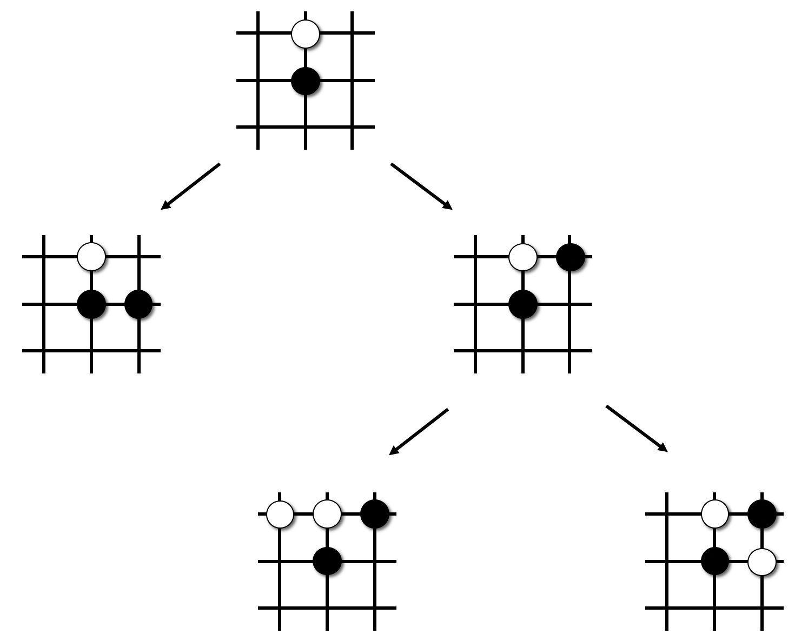
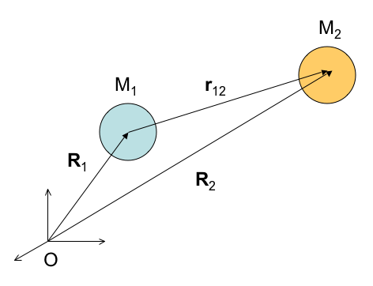

class: center, middle

# CME 213, ME 339 - Winter 2020

## Eric Darve, ICME


“A great lathe operator commands several times the wage of an average lathe operator, but a great writer of software code is worth 10,000 times the price of an average software writer.”
(Bill Gates)

---
class: center, middle

# OpenMP

Central for multicore scientific computing

`#pragma omp parallel for`

Next:

`#pragma omp task`

---
class: center, middle

Many situations require a more flexible way of expressing parallelism

Example: tree traversal

---
class: center, middle



---
class: img-right


# Tree traversal

Go through each node and execute some operation

Tree is not full, e.g., number of child nodes varies

---
class: middle

```
void Traverse(struct Node *curr_node)
{
    // Pre-order = visit then call Traverse()
    Visit(curr_node);

    if (curr_node->left)
#pragma omp task
        Traverse(curr_node->left);

    if (curr_node->right)
#pragma omp task
        Traverse(curr_node->right);
}
```

---
class: middle

In `main()`

```
#pragma omp parallel
#pragma omp single
{
    // Only a single thread should execute this
    Traverse(root);
}
```

---
class: center, middle

The encountering thread may immediately execute the task, or defer its execution. 

Any thread in the team may be assigned the task.


---
class: center, middle

# Post-order traversal


---
class: center, middle

This algorithm requires waiting for traversal to be complete before visiting the node

---
class: middle

```
int PostOrderTraverse(struct Node* curr_node) {
    int left = 0, right = 0;

    if(curr_node->left)
        #pragma omp task shared(left)
        left = PostOrderTraverse(curr_node->left);
    // Default attribute for task constructs is firstprivate

    if(curr_node->right)
        #pragma omp task shared(right)
        right = PostOrderTraverse(curr_node->right);

    #pragma omp taskwait
    curr_node->data = left + right; // Number of children nodes
    return 1 + left + right;
}
```
---
class: middle, center

`firstprivate`

Private but value is initialized with the original value when the construct is encountered

---
class: middle, center

`taskwait`

Wait on the completion of the child tasks of the current task

---
class: middle, center

Next example

Processing entries in a list

---
class: middle

```
#pragma omp parallel
#pragma omp single
{
    Node* curr_node = head;
    while(curr_node) {
        #pragma omp task
        {
            // curr_node is firstprivate by default
            Visit(curr_node);
        }
        curr_node = curr_node->next;
    }
}
```

---
class: center, middle

More recent features of `task`

---
class: middle

# Priority

```
for (i=0;i<N; i++) {
    #pragma omp task priority(i)
    compute_array(&array[i*M], M);
}
```

Higher priority = task is a candidate to run sooner

---
class: center, middle

# Dependence

`taskwait`

But, dependencies between tasks can be specified in a fine-grained fashion

---
class: center, middle

` depend(dep-type: x)`

`dep-type` is one of

 
`in`, `out`, `inout`, `mutexinoutset`

---
class: middle

```
#pragma omp parallel
#pragma omp single
{
    #pragma omp task shared(x) depend(out: x)
    x = 2;
    #pragma omp task shared(x) depend(in: x)
    printf("x = %d\n", x);
}
```

Always prints `x = 2`

---
class: center, middle

`dep-type` | waits on  | waits on | waits on |
--- | --- | --- | ---
`in` | | `out`/`inout` | `mutexinoutset`
`out`/`inout` | `in` | `out`/`inout` | `mutexinoutset`
`mutexinoutset` | `in` | `out`/`inout` | `mutexinoutset`

---
class: middle

```
int x = 1;
#pragma omp parallel
#pragma omp single
{
    #pragma omp task shared(x) depend(in: x)
    printf("x = %d\n", x);
    #pragma omp task shared(x) depend(out: x)
    x = 2;
}
```

Always prints `x = 1`

---
class: middle

```
#pragma omp parallel
#pragma omp single
{
    #pragma omp task depend(out: c)
    c = 1; /* Task T1 */
    #pragma omp task depend(out: a)
    a = 2; /* Task T2 */
    #pragma omp task depend(out: b)
    b = 3; /* Task T3 */
    #pragma omp task depend(in: a) depend(mutexinoutset: c)
    c += a; /* Task T4 */
    #pragma omp task depend(in: b) depend(mutexinoutset: c)
    c += b; /* Task T5 */
    #pragma omp task depend(in: c)
    d = c; /* Task T6 */
}
printf("d = %1d\n", d);
```

---
class: middle, center

# OpenMPMaster and Synchronization Constructs

---
class: middle

# Reduction

```
#pragma omp parallel for reduction (+:sum)
for(int i = 0; i < size; i++) {
    sum += a[i];
}
```

---
class: middle, center

Prevent a race condition when updating `sum`

Improved efficiency


---
class: middle, center

 Exercise: `entropy.cpp`

---
class: middle, center

# Atomic

Not as efficient as `reduction`

Allows: `+=`, `*=`, `/=`, ...

---
class: middle, center


---
class: middle, center



---
class: middle

```
#pragma omp parallel for
for (int i = 0; i < n; ++i)
    for (int j = i + 1; j < n; ++j)
    {
        const float x_ = x[i] - x[j];
        const float f_ = force(x_);
#pragma omp atomic
        f[i] += f_;
#pragma omp atomic
        f[j] -= f_;
    }
```

---
class: middle, center

`critical`

Restricts execution of the associated structured block to a single thread at a time

`critical.cpp`

---
class: middle

```
set<int> m;
#pragma omp parallel for
for (int i = 2; i <= n; ++i)
{
    bool is_prime = is_prime_test(i);

#pragma omp critical
    if (is_prime)
        m.insert(i); /* Save this prime */
}
```
