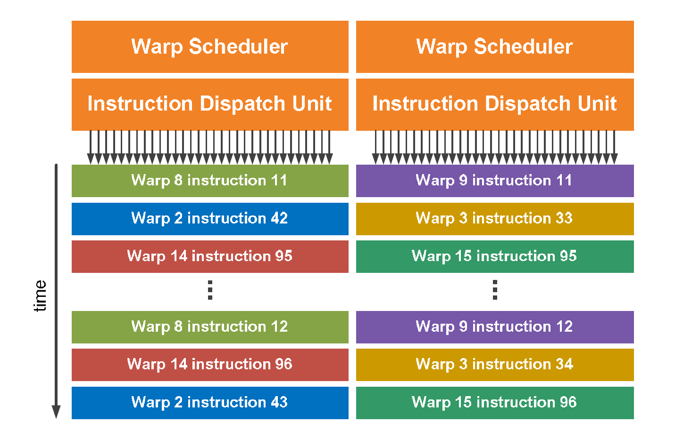

class: center, middle

# CME 213, ME 339 - Winter 2020

## Eric Darve, ICME

“Software is like entropy: It is difficult to grasp, weighs nothing, and obeys the Second Law of Thermodynamics; i.e., it always increases.”
(Norman Augustine)

---
class: center, middle

# Concurrency and latency

---
class: center, middle

Imagine you are a pencil manufacturer.

You outsource your manufacturing plants to China but your market is in the US.

How do you organize the logistics of the transport?

---
class: middle

Concurrency is used to hide long latencies:

- memory access
- floating point units
- any long sequence of operations

---
class: center, middle

Processors are optimized in the same way

Hide latency through concurrency

---
class: middle

How to maximize concurrency?

- Have as many live threads as possible
- Instruction-level parallelism

---
class: middle

# Hardware limits

- Max dim. of grid: y/z 65,535 (x is huge, $2^{31}−1$)
- Max dim. of block: x/y 1,024; z 64
- Max \# of threads per block: 1,024
- Max blocks per SM: 16
- Max resident warps: 64
- Max threads per SM: 2,048
- \# of 4-byte registers per block: 65,536 (128K per block)
- Max shared mem per block: 49,152 (112 KB per block)

---
class: center, middle

# How can we make sense of this?

---
class: middle

# CUDA API

Achieve best potential occupancy; recommended parameter selections

`cudaOccupancyMaxActiveBlocksPerMultiprocessor`

Number of blocks on each SM (based on given block size and shared memory usage)

---
class: middle

`cudaOccupancyMaxPotentialBlockSize` 
`cudaOccupancyMaxPotentialBlockSizeVariableSMem`

Minimum grid size and recommended block size to achieve maximum occupancy

---
class: center, middle

Occupancy spreadsheet!

[CUDA Occupancy Calculator](https://docs.nvidia.com/cuda/cuda-occupancy-calculator/CUDA_Occupancy_Calculator.xls)
