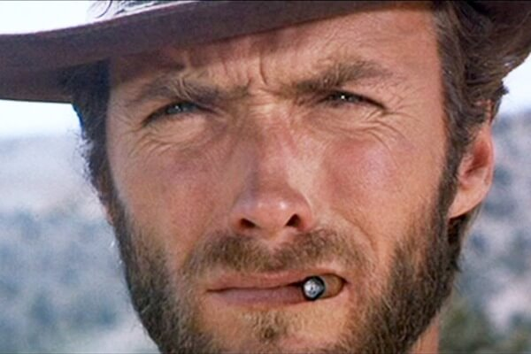

class: center, middle

# CME 213, ME 339 - Winter 2020

## Eric Darve, ICME

“Physics is the universe's operating system.”
(Steven R Garman)

---
class: center, middle

# Final project

---
class: center, middle

# Goal

Implementing a neural network in order to recognize hand-written digits

---
class: center, middle

# Logistics

Turn in | Date | Grade
--- | ---
Preliminary report + code | Friday March 6th 11 PM | 20%
Final report (4 pages) + code | Wednesday March 18th 11 PM | 80%

---
class: center, middle

# Preliminary report

Focus is on correctness

---
class: center, middle

# Final report

Profiling and analysis, performance, quality of report

What are the performance bottlenecks in your code? 

How can they be addressed?

---
class: center, middle

# Correctness

Discuss your strategy to test your code

Test outputs for valid inputs

Make sure you distinguish roundoff errors from genuine bugs

---
class: center, middle

---
class: center, middle

---
class: center, middle

---
class: center, middle

Input layer: image

Hidden layer: `-n num`; variable size

Output layer: `softmax` vector with 10 digits

---
class: center, middle

# Softmax

$$\text{softmax}(z)\_j = \frac{\exp z\_j}{\sum_{i=1}^{10} \exp z\_i}$$

Interpreted as a probability

---
class: center, middle

Each layer is a matrix multiplication and a non-linear function

$$z = W x + b$$

$$a = \sigma(z)$$

---
class: center, middle

---
class: center, middle

# How do you train a network?

Many methods but most are based on gradient descent

---
class: center, middle

# Error function

$$J(p) = \frac{1}{N} \sum\_{i=1}^N \text{error}^{(i)}(y_i,\hat{y}_i)$$

$p$: Weights and biases of network = all parameters

---
class: center, middle

# Gradient update

$$p \leftarrow p - \alpha \nabla_p J$$

Gradient is computed by repeated application of the chain rule

Backpropagation

---
class: center, middle

---
class: center, middle

# Stochastic gradient descent

$$J\_r(p) = \frac{1}{N} \sum\_{i \in \text{random subset}} \text{error}^{(i)}(y\_i,\hat{y}\_i)$$

$$p \leftarrow p - \alpha \nabla\_p J\_r$$

---
class: center, middle

If we use a small subset, this allows more updates to the DNN coefficients

&rArr; more accurate

---
class: center, middle

Randomness of subset selection allows avoiding local minima

&rArr; better convergence

---
class: center, middle

# Sequence of operations

Forward pass = left to right; DNN prediction; compare with label

Backward propagation = right to left; chain rule; compute gradient and update DNN

Iterate until convergence

---
class: center, middle

---
class: middle

# Core building blocks to implement

- Matrix-matrix products
- Non-linear activation functions

---
class: center, middle

[https://playground.tensorflow.org](https://playground.tensorflow.org)

---
class: center, middle

---
class: center, middle

---
class: center, middle

---
class: center, middle

---
class: center, middle

# Regularization

$$J(p) = \frac{1}{N} \sum\_{i=1}^N \text{error}^{(i)}(y_i,\hat{y}_i) + \frac{1}{2} \, \lambda \, || p ||\_2^2$$

$p$: weights and biases of the network

---
class: center, middle

$$z = W x + b$$

$$a = \sigma(z)$$

Regularization makes the DNN more linear

---
class: center, middle

How can we figure out how much regularization is needed?

---
class: center, middle

Training set: used to minimize loss; involved in defining the gradient

Test set: used to test model; how accurate is it? Avoids overfitting

---
class: center, middle

???

- green fit: regularized
- orange: overfitted

---
class: center, middle

Training | Test | Diagnostic
--- | --- | ---
 |  | Overfitting; &uarr; $\lambda$
 |  | Too much regularization; &darr; $\lambda$ 
 |  | Regularization is good

---
class: middle

- Training set: optimize DNN parameters
- Test set: optimize regularization
- Validation set: [optional] can be used to adjust the hyperparameters of the network