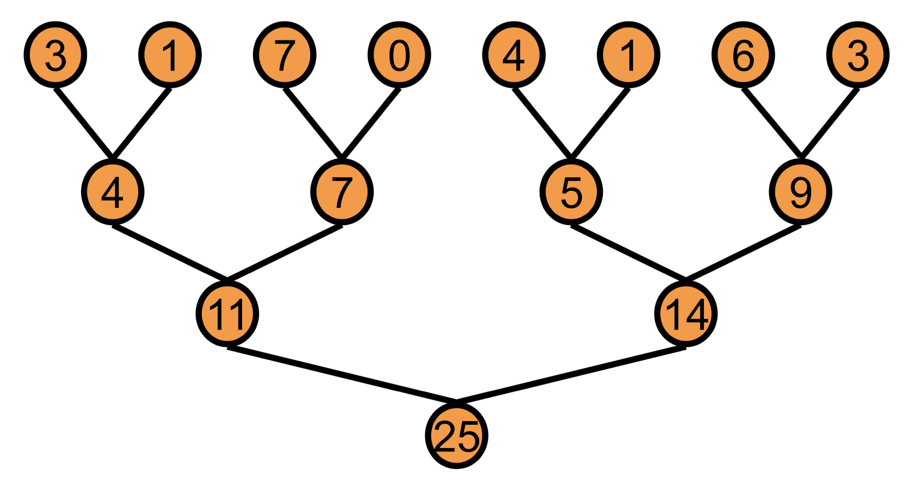
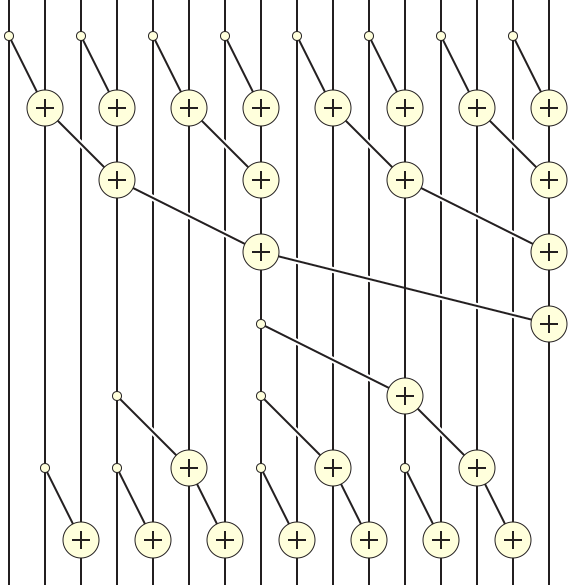
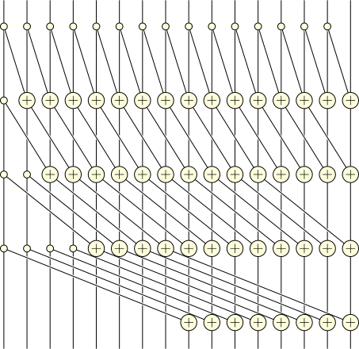
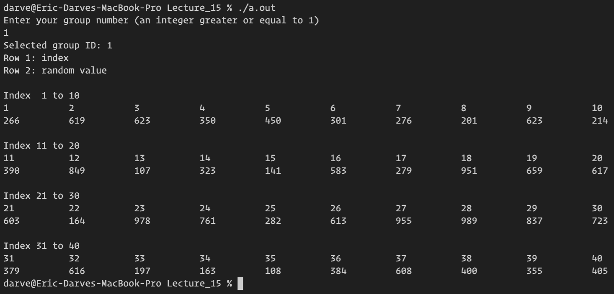
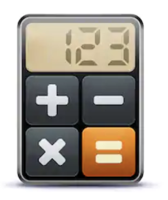

class: center, middle

# CME 213, ME 339 - Winter 2020

## Eric Darve, ICME


“The greatest enemy of knowledge is not ignorance, it is the illusion of knowledge.” (Stephen Hawking)

---
class: center, middle

# Today: group activity with prefix scan


---
class: center, middle

# Parallel reduction or scan



---
class: center, middle

# Cumulative sum or prefix scan

    3   5   6   2   4
    3   8  14  16  20

---
class: center, middle

Algorithm 1

Work efficient

---
class: middle

Two phases

1. Collect or reduce
2. Distribute

---
class: center, middle



---
class: center, middle

Number of passes: $2 \log_2 n − 2$

Amount of work: ~ 2 x sequential flops

---
class: center, middle

# Can we reduce the running time by adding more flops?

---
class: center, middle

Hillis&ndash;Steele algorithm

Main idea

Concurrent tree reductions

---
class: center, middle



---
class: center, middle

Number of passes: $\log_2 n$ vs $2 \log_2 n$

Amount of work: ~ $\log_2 n$ x sequential flops

---
class: center, middle

When a lot of processors are available, Hillis&ndash;Steele algorithm is superior

Shorter span vs work-efficient

---
class: center, middle

 Form teams of 8 players

 Goal of activity: parallel prefix scan using human processors

---
class: middle

Download the code from class web page:

[generate_sequence.cpp](URL)

Compile and run

```
$ g++ -std=c++11 generate_sequence.cpp; ./a.out
```

---
class: middle

Each group of players is assigned a unique group ID

```
$ g++ -std=c++11 generate_sequence.cpp; ./a.out
```

Enter your group number

---
class: center, middle



The code returns a sequence of random numbers.

This is the sequence you use for the cumulative sum.

---
class: middle

Take small pieces of paper of size approximately 3in x 3in.

- Top left: write the group number
- Top right: write the random number
- Center: write the index and the result of the cumulative sum

---
class: center, middle

Make sure you write the correct index and random number. 

Any error will lead to the wrong cumulative sum at the end!

---
class: center, middle

# Rules!

A **memloc** is a piece of paper with a single number written on it. 

You can strike/erase a number to write a new one. 

A **memloc** is full when it has a number on it, and empty otherwise.

---
class: center, middle

# Player roles

There are 3 types of players: **mem**, **net**, **pu**. 

Each player has only one type. 

You can have as many players of each type as you want.

---
class: center, middle

# The thinkers

**mem** player: can copy and strikethrough numbers


---
class: center, middle

# The runners

**net** player: can take/give memlocs to mem and pu. Cannot hold more than 3 memlocs at a time


---
class: center, middle

# The machines

**pu** player: can take two full memlocs and one empty memloc, add the numbers on the full memlocs (may use a calculator) and write the result on the empty memloc. 

Can exchange memlocs with net. 

Cannot hold more than 3 memlocs at a time.



---
class: center, middle

# Distance

There shall be a distance of at least 20 meters between a **pu** and **mem**.

---
class: center, middle

# Pick a team name


---
class: center, middle


---
class: center, middle


---
class: center, middle

# Discussion

What were the main bottlenecks?

How did you organize your group?

What was the best strategy?

What would you do different?


