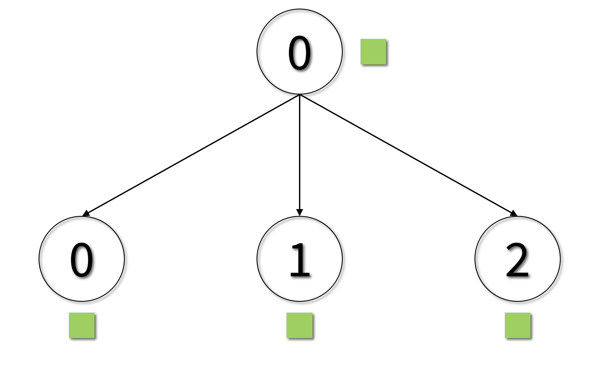
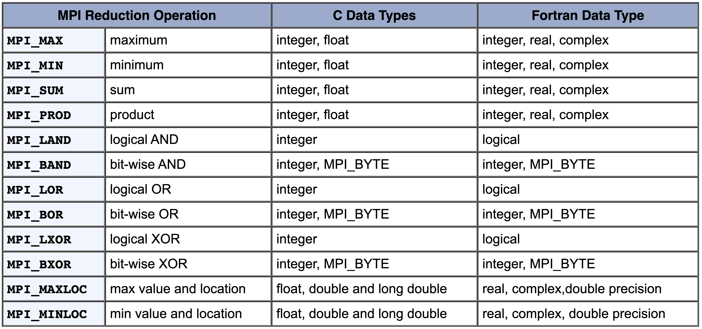
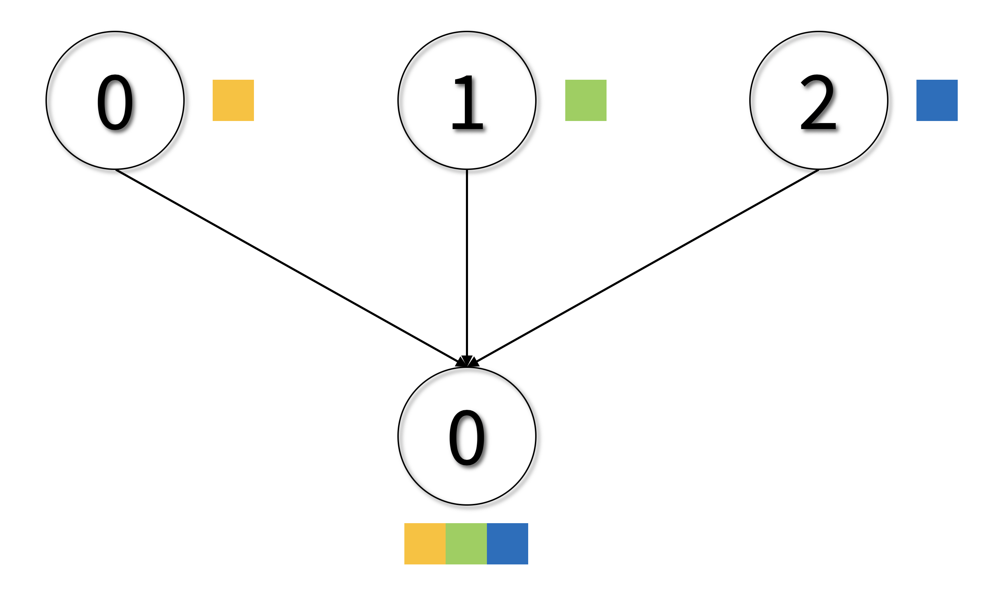
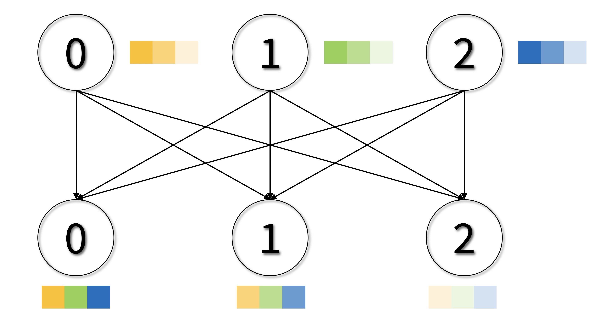

class: center, middle

# CME 213, ME 339 - Winter 2020

## Eric Darve, ICME


“Where is the ‘any’ key?”
— Homer Simpson, in response to the message, “Press any key”

---
class: center, middle

# Distributed memory computing using MPI

---
class: center, middle

Shared memory is a good model<br> for a small number of processes.

---
class: center, middle

When dealing with a large number of processors,<br>we need to view the memory as being distributed.

---
class: center, middle

What this means:

Processors can no longer directly read and write<br>to another processor's memory

---
class: center, middle

Instead processors exchange messages.

Programmed by the user explicitly.

Send + Receive

---
class: center, middle

This can be done using MPI.

MPI is the standard for distributed memory computing. 

**Message Passing Interface**

---
class: center, middle

# Flynn’s taxonomy

.red[SIMT]: one instruction is dispatched to multiple threads. 

Warp on a GPU

---
class: center, middle

.red[SIMD]: same instruction run by different processing units using different data

Vector processing units


---
class: center, middle

.red[MIMD]: multiple instructions, multiple data; multiple threads running different functions

Multicore threads


---
class: center, middle

.red[SPMD]: this is our topic for today. 

One program running on different processors. 
 
Processors communicate through a network by exchanging messages or data in an explicit manner.

---
class: center, middle


---
class: center, middle


---
class: middle

# Where can I get MPI?

- OpenMPI: [www.open-mpi.org](https://www.open-mpi.org/)<br>(what we use for the GCP VM)
- MVAPICH: [mvapich.cse.ohio-state.edu](http://mvapich.cse.ohio-state.edu/)
- MPICH: [https://www.mpich.org/](www.mpich.org)

---
class: center, middle

# What computer can I use it with?

You can test MPI using a **multicore** computer.

Each process runs on its own core.

You can run this on **GCP** or your **laptop**.

---
class: center, middle

# GCP and cores

GCP gives you access to virtual machines.

**virtual CPU** (vCPU)

A vCPU is implemented as a single hardware hyper-thread on one of the available CPU Platforms.

---
class: center, middle

This means that when you request cores, you don’t really know what cores you get and where they are.

They could be physically on the same processor/board (the most likely), but they may be on different motherboards.

However, when querying the computer, it will look like you have a single processor with many cores and shared memory.

---
class: middle

# Compiling

Compile with:<br>
`mpic++`

Header:<br>
`mpi.h`

---
class: center, middle

Running is more complicated than usual.

You need to start multiple processes on multiple computers.

You need to make sure all processes are killed or terminated at the end.

&rArr; &nbsp; `mpirun`

---
class: center, middle


---
class: center, middle

# Transfer layer

[mpirun](https://www.open-mpi.org/doc/current/man1/mpirun.1.php) &mdash; Open MPI doc

Many **transport layers** (software/hardware used to exchange data) are available

Examples: InfiniBand, Libfabric, Portals4, PSM2, shared memory, TCP sockets, ...

---
class: center, middle

**openib** is the option to use the **OpenFabrics** network

It is not available on GCP

---
class: middle

MCA: Modular Component Architecture; allows to specify options in `mpirun`

`ompi_info --params all all`

to get all options

- **BTL:** byte transfer layer (point-to-point byte movement)
- MTL: matching transport layer (MPI-2 one-sided communications)
- PML: point-to-point management layer (fragmenting, reassembly, top-layer protocols)

---
class: middle

Options for BTL: `tcp`, `vader`, `openib`, `sm`, `self`

`vader` and `sm` are shared memory byte transfer layers

`openib` high-performance (OpenFabrics Alliance software stack); InfiniBand and iWARP networks

`tcp` default; works on all networks

---
class: center, middle

So...


---
class: middle


---
class: center, middle

`-n` or `-np` is the number of processes to run

[mpi_hello.cpp](https://github.com/stanford-cme213/stanford-cme213.github.io/blob/master/Code/Lecture_16/mpi_hello.cpp)

---
class: middle

```
  MPI_Init(&argc, &argv);

  int numprocs;
  MPI_Comm_size(MPI_COMM_WORLD, &numprocs);

  int rank;
  MPI_Comm_rank(MPI_COMM_WORLD, &rank);

  // Do something based on rank
  printf("Hello from rank %2d running on node: %s\n", rank, hostname);

  int len;
  char hostname[MPI_MAX_PROCESSOR_NAME];
  MPI_Get_processor_name(hostname, &len);

  MPI_Finalize();
```

---
class: center, middle

# Computing $\pi$ using MPI

---
class: center, middle


---
class: center, middle

[mpi_pi_send.cpp](https://github.com/stanford-cme213/stanford-cme213.github.io/blob/master/Code/Lecture_16/mpi_pi_send.cpp)

---
class: middle

```
if (rank != MASTER)
{
    int tag = i;
    int rc = MPI_Send(&my_pi, 1, MPI_DOUBLE,
                      MASTER, tag, MPI_COMM_WORLD);

    if (rc != MPI_SUCCESS)
        printf("%d: Send failure on round %d\n", rank, tag);
}
else
{
    ...
}
```

---
class: middle

```
int MPI_Send(void *smessage, int count,
	MPI_Datatype datatype, int dest,
	int tag,
	MPI_Comm comm)
```    

`smessage` buffer which contains the data<br>
`count` number of elements to be sent<br>
`datatype` data type of entries<br>
`dest` rank of the target process<br>
`tag` message tag which (used to distinguish messages)<br>
`comm` communicator used for the communication

---
class: center, middle


???

https://www.mpi-forum.org/docs/mpi-2.1/mpi21-report-bw/node330.htm

---
class: middle

```
if (rank != MASTER) { ... } else {
    int tag = i; double pisum = 0;

    for (int n = 1; n < numprocs; n++) {
        double pirecv; MPI_Status status;
        int rc = MPI_Recv(&pirecv, 1, MPI_DOUBLE, MPI_ANY_SOURCE,
                            tag, MPI_COMM_WORLD, &status);
        if (rc != MPI_SUCCESS)
            printf("%d: Receive failure on round %d\n", rank, tag);
        /* Running total of pi */
        pisum += pirecv;
    }
}      
```

---
class: middle

```
int MPI_Recv(void *rmessage, int count,
	MPI_Datatype datatype, int source,
	int tag, MPI_Comm comm,
	MPI_Status *status)
```    

Mostly same as before. One new argument:

`status` data structure that contains information about the message that was received

---
class: center, middle

# Rules and order

Each `Send` must be matched with a corresponding `Recv`.

Order: messages are delivered in the order in which they have been sent. 

---
class: center, middle

If a sender sends two messages of the same type one after another to the same receiver, the MPI runtime system ensures that the first message sent is always received first. 

---
class: center, middle

# Collective communications

---
class: center, middle

What we have discussed so far is **point-to-point communication,** that is one process communicates with another process.

---
class: center, middle


Let’s say that we have a group of processes that need to exchange data. 

For example we want to do a **reduction.**

This is called a collective communication, i.e., multiple processes need to communicate.

---
class: center, middle

For best performance, we need to orchestrate the communication. 

Simply having each process send its data to the master node is inefficient.

---
class: center, middle


---
class: center, middle

Computer network = network of highways

Each highway has a number of lanes and a maximum traffic it can support. This is the bandwidth.


---
class: middle

Depending on the network topology, there is an optimal algorithm to route the messages in order to minimize the total wall clock time of the collective communication.

Three key issues:

1. These communication algorithms can be complicated.
2. They depend on the network topology.
3. There are relatively few collective communication patterns that get reused over and over again.

---
class: center, middle

```
MPI_Bcast(&buffer,count,datatype,root,comm)
```



---
class: center, middle

```
MPI_Reduce(&sendbuf,&recvbuf,count,datatype,op,root,comm)
```


---
class: center, middle



???

https://computing.llnl.gov/tutorials/mpi/

---
class: center, middle


---
class: middle

```
for (int n = mystart; n <= LIMIT; n += stride) {
    if (IsPrime(n)) {
        pc++;         // found a prime
        foundone = n; // last prime that we have found
    }
}
// Total number of primes found by all processes: MPI_SUM
MPI_Reduce(&pc, &pcsum, 1, MPI_INT, MPI_SUM, MASTER, MPI_COMM_WORLD);

// The largest prime that was found by all processes: MPI_MAX
MPI_Reduce(&foundone, &maxprime, 1, MPI_INT, MPI_MAX, MASTER, MPI_COMM_WORLD);
```

---
class: center, middle

# About prime numbers

[Pattern of prime numbers](https://www.jasondavies.com/primos/)

Perfect number: equal to the sum of its divisors

Euclid proved that $2^{p−1}(2^p − 1)$ is a perfect number whenever $2^p − 1$ is prime

6, 28, 496, 8128, ...

---
class: center, middle

```
MPI_Gather(&sendbuf,sendcnt,sendtype,&recvbuf,recvcount,recvtype,root,comm)
```



---
class: center, middle

```
MPI_Scatter(&sendbuf,sendcnt,sendtype,&recvbuf,recvcnt,recvtype,root,comm)
```


---
class: center, middle

# Final project

Rank 0 reads MNIST data from disk

`MPI_Scatter` the images to all processors

---
class: center, middle

```
MPI_Allgather(&sendbuf,sendcount,sendtype,&recvbuf,recvcount,recvtype,comm)
```


---
class: center, middle

```
MPI_Allreduce(&sendbuf,&recvbuf,count,datatype,op,comm)
```


---
class: center, middle

# Final project

$$J(p) = \frac{1}{N} \sum\_{i=1}^N \text{error}^{(i)}(y\_i,\hat{y}\_i)$$

$$p \leftarrow p - \alpha \nabla J_p$$

Each process has a partial $\nabla J_p$

`MPI_Allreduce` to get all complete gradient on all processors

---
class: center, middle


---
class: middle

```
int localres[2], globalres[2];
localres[0] = localarr[0]; // Minimum
for (int i = 1; i < locn; i++)
    if (localarr[i] < localres[0])
        localres[0] = localarr[i];

// The second entry is the rank of this process.
localres[1] = rank;

// MPI_MINLOC: like the operator min. The difference is that it
// takes as input two numbers; the first one is used to determine the
// minimum value. The second number just goes along for the ride.
// MPI_2INT: type for 2 integers.
MPI_Allreduce(localres, globalres, 1, MPI_2INT, MPI_MINLOC, MPI_COMM_WORLD);
```

---
class: center, middle

```
MPI_Alltoall(&sendbuf,sendcount,sendtype,&recvbuf,recvcnt,recvtype,comm)
```

