class: center, middle

# CME 213, ME 339 - Winter 2020

## Eric Darve, ICME


“Programs must be written for people to read, and only incidentally for machines to execute.”
— Abelson and Sussman

---
class: center, middle

Let's learn about MPI communicator and groups with linear algebra

---
class: center, middle

Matrix-vector product

$$ b = A x $$

---
class: center, middle

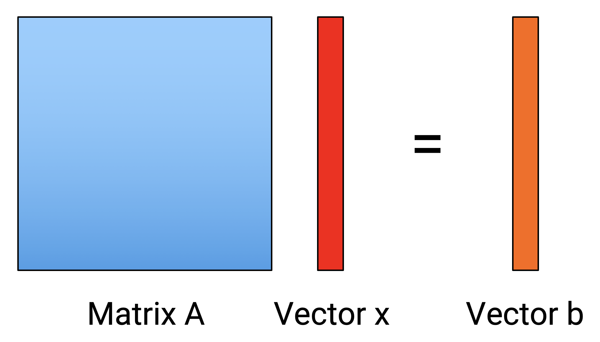

---
class: center, middle

# Strategy 1: row partitioning

---
class: center, middle

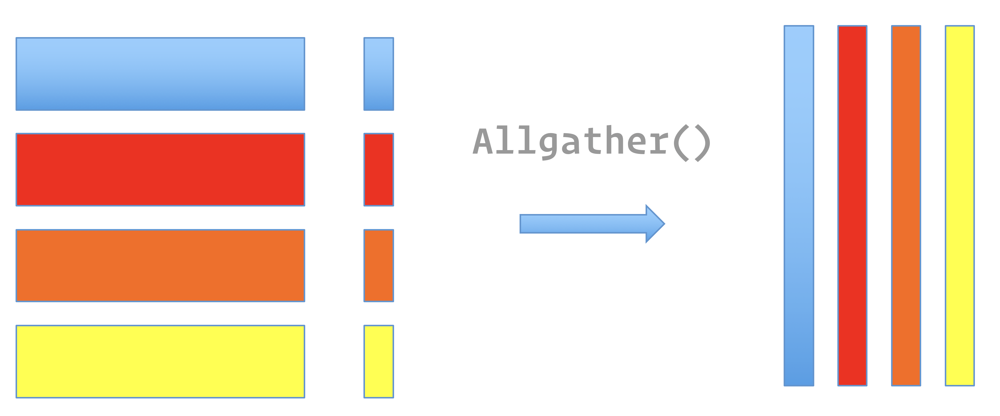

---
class: center, middle

Step 1: replicate $b$ across all processes

```
MPI_Allgather()
```

---
class: center, middle

Step 2: local product; no communication

[matvecrow.cpp](https://github.com/stanford-cme213/stanford-cme213.github.io/blob/master/Code/Lecture_17/matvecrow.cpp)

---
class: middle

```
// Gather entire vector b on each processor using Allgather
MPI_Allgather(&bloc[0], nlocal, MPI_FLOAT, &b[0], nlocal, MPI_FLOAT,
            MPI_COMM_WORLD);
// sending nlocal and receiving nlocal from any other process

// Perform the matrix-vector multiplication involving the
// locally stored submatrix.
for(int i=0; i<nlocal; i++) {
    for(int j=0; j<n; j++) {
        x[i] += a[i*n+j] * b[j];
    }
}
```

---
class: center, middle

# Strategy 2: column partitioning

---
class: center, middle

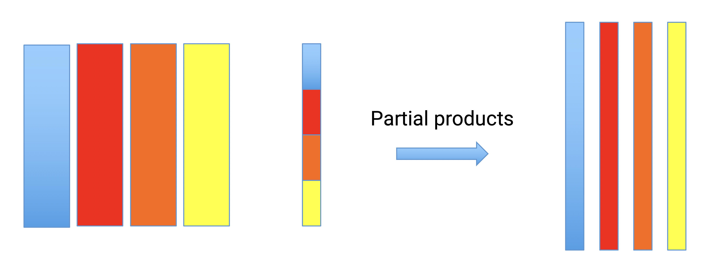

---
class: center, middle

Step 1: calculate partial products with each process

---
class: center, middle

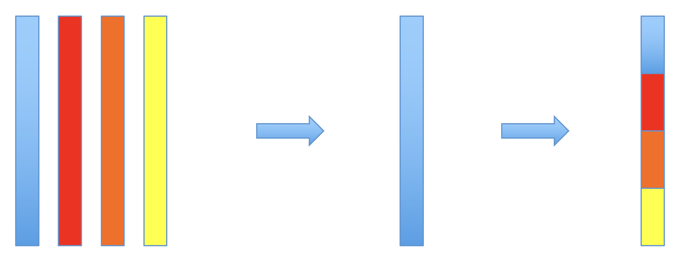

---
class: center, middle

Step 2: reduce all partial results

```
MPI_Reduce()
```

Step 3: send sub-blocks to all processes

```
MPI_Scatter()
```

---
class: center, middle

Performance is very similar to row partitioning

---
class: center, middle

If we have many processors, previous approaches lose efficiency

---
class: center, middle

Better approach: 2D block partitioning

---
class: center, middle


---
class: center, middle

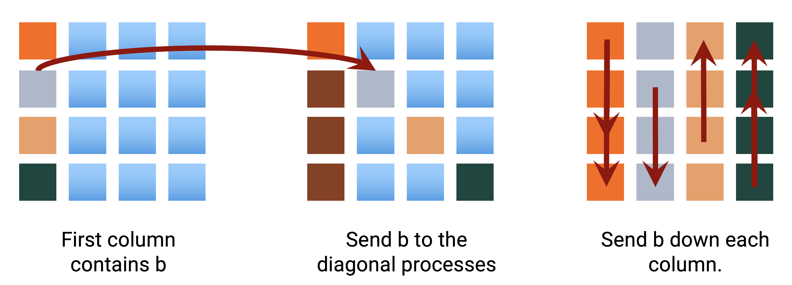

---
class: center, middle

Step 1: P2P communication

Step 2: broadcast in each column

Step 3: local matrix-vector product

---
class: center, middle


---
class: center, middle

Step 4: reduction across columns

---
class: center, middle

In this approach, we have avoided communications between all processes.

Only subsets communicate.

---
class: center, middle

In addition, we can assign a process per block

**More processes** can be used compared to row/column partitioning

---
class: center, middle

How can we quantify this improvement?

---
class: center, middle

# Basic concepts in parallel program efficiency

---
class: middle

$T_p(n)$: running time

Matrix of size $n$ and $p$ processes

Breakdown down:

- Computation time
- Communication time
- Idle (waiting on data to continue)

---
class: center, middle

# Speedup

$T_1(n)$ execution time in serial

$$ S = \frac{T_1(n)}{T_p(n)} $$

---
class: center, middle

$$ S = \frac{T_1(n)}{T_p(n)} $$

Ideally: $S \sim p$

---
class: center, middle

# Amdahl's law

$$ S_p(n) \sim \frac{T_1(n)}{f T_1(n) + (1-f) T_1(n) / p} $$

$$ S_p(n) \sim \frac{1}{f + (1-f) / p} \le \frac{1}{f} $$

---
class: center, middle

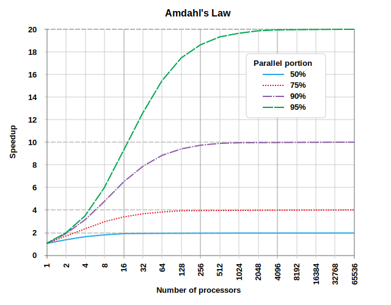

---
class: middle

This law is not perfect

- Decomposition into completely serial and parallelizable is simplistic
- More importantly: $f$ is typically a function of $n$.

That's why there are programs that can scale to very large sizes

---
class: center, middle

Nevertheless, it contains a key lesson.

As you add more processes to your computation, the serial parts of the algorithm become dominant.

As $p$ &uarr;, more and more parts of the program need to be parallelized.

Difficulty &uarr;

---
class: center, middle

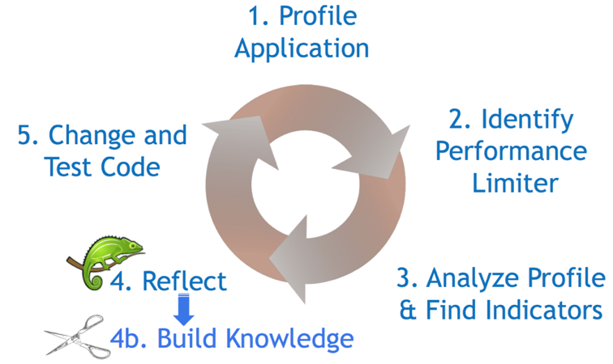

---
class: center, middle

Speedup is difficult to visualize

Expected to increase like $p$

---
class: center, middle

Better is to plot the efficiency

Speedup divided by $p$

$$ E_p(n) = \frac{S_p(n)}{p} = \frac{T_1(n)}{p T_p(n)} $$

---
class: center, middle

Ideally, efficiency remains constant as $p$ increases

---
class: center, middle

Typical trends

---
class: center, middle

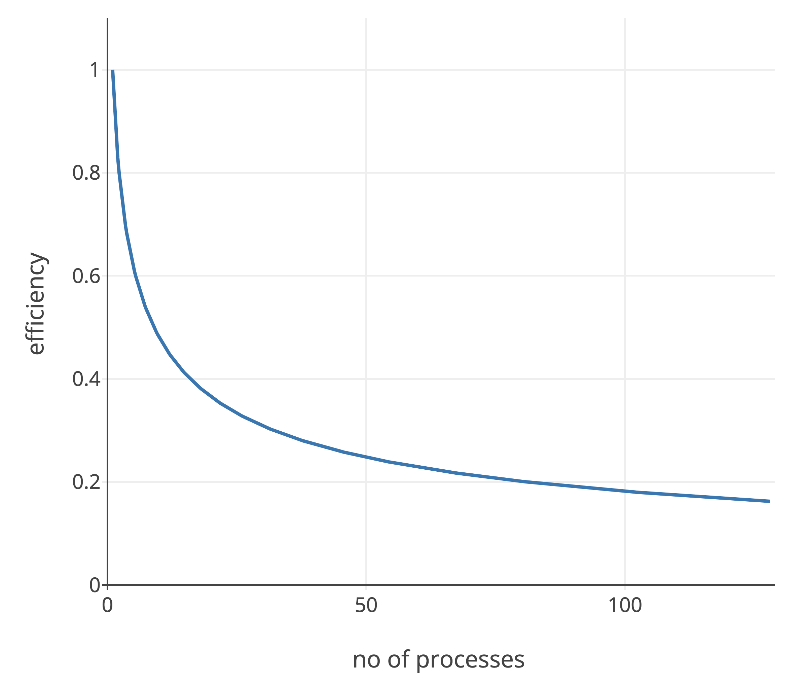

---
class: center, middle

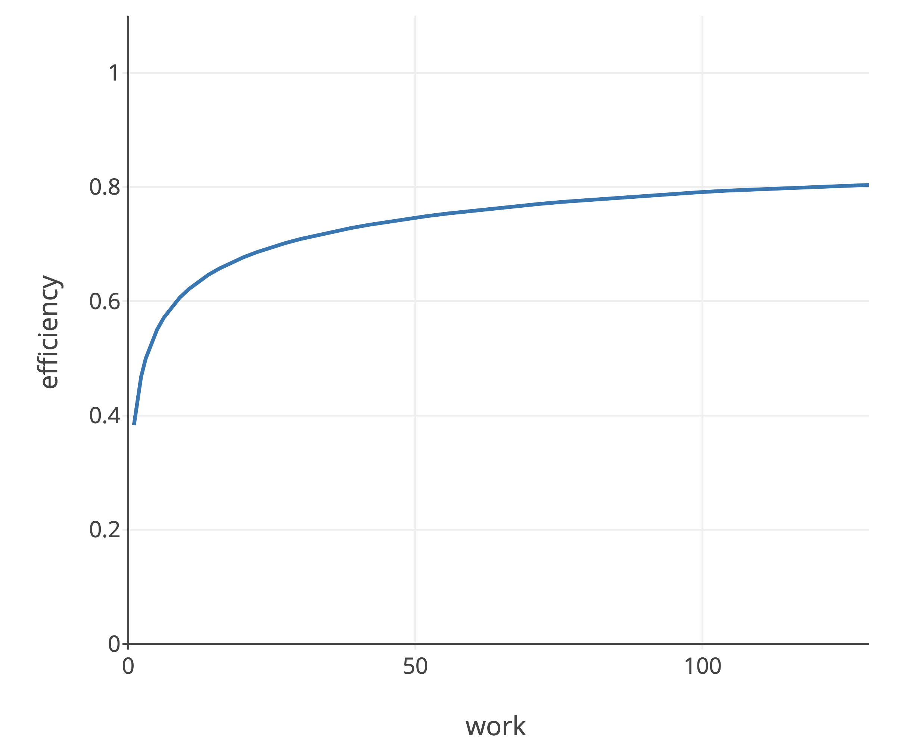

---
class: center, middle

Let's apply these ideas to matrix-vector multiplications and see which algorithm is best

---
class: center, middle

We need to estimate the running time of communication

---
class: center, middle

# Collective communication

---
class: center, middle

Operation | Hypercube time
--- | ---
One-to-all broadcast<br>All-to-one reduction | $\min \\{ (t_s + t_w m) \log p, 2 (t_s \log p + t_w m) \\}$
All-to-all broadcast<br>All-to-all reduction | $t_s \log p + t_w m (p-1)$
All-reduce | $\min \\{ (t_s + t_w m) \log p, 2 (t_s \log p + t_w m) \\}$
Scatter, Gather | $t_s \log p + t_w m (p-1)$
All-to-all personalized | $(t_s + t_w m) (p-1)$
Circular shift | $t_s + t_w m$

---
class: center, middle

 $m$: size of message

 $p$: number of processes

 $t_s$: latency

 $t_w$: reciprocal bandwidth

---
class: center, middle

Application to matrix-vector product

---
class: middle

# Row partitioning

Serial:

$$T_1(n) = \alpha n^2$$

Parallel: computation + communication

$$T_p(n) = \alpha \frac{n^2}{p} + \beta \ln p + \gamma n$$

---
class: middle

$$T_1(n) = \alpha n^2$$

$$p T_p = \alpha n^2 + \beta p \ln p + \gamma p n$$

Efficiency: $ E = T_1 / (p T_p)$

$$E_p(n) = \frac{1}{1 + (\beta/\alpha) p \ln p / n^2 + (\gamma/\alpha) p/n} $$

---
class: center, middle

# Iso-efficiency

How quickly can we increase $p$ such that the efficiency is constant?

---
class: center, middle

$$ E_p(n) = \frac{1}{1 + (\beta/\alpha) p \ln p / n^2 + (\gamma/\alpha) p/n} $$

If $p = \Theta(n)$, $E_p(n) = $ constant.

Proof: $p \ln p / n^2 \to 0$, and $p/n = $ constant

---
class: center, middle

Compare with 2D block scheme

---
class: middle

Computation

$\alpha \frac{n^2}{p}$

Send $b$ to diagonal

$\beta + \gamma \frac{n}{\sqrt{p}}$

$\sqrt{p}$ because of block partition

---
class: middle

Broadcast in each column

$(\beta + \gamma \frac{n}{\sqrt{p}}) \log \sqrt{p}$

Reduction across column

$(\beta + \gamma \frac{n}{\sqrt{p}}) \log \sqrt{p}$

$\log \sqrt{p}$ because of collective communication

---
class: center, middle

# Efficiency

$$ E_p(n) = \frac{1}{1 + (\beta/\alpha) (p \log p) / n^2 + (\gamma/\alpha) (p^{1/2} \log p)/n} $$

Iso-efficiency: $p = \Theta(n^2 / \log^2 n)$

---
class: center, middle

Row partitioning: $p = \Theta(n)$

2D partitioning: $p = \Theta(n^2 / \log^2 n)$

Which one is better?

---
class: center, middle

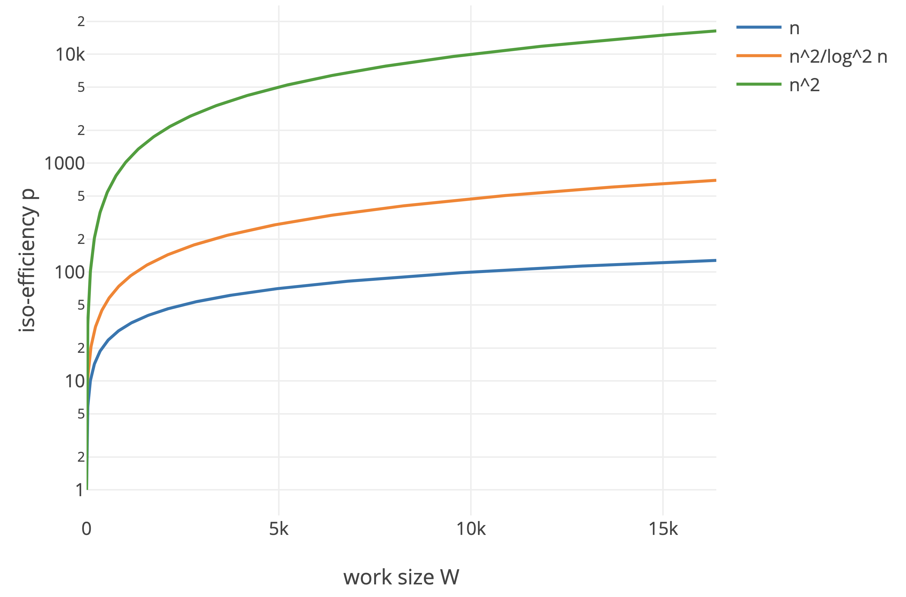

---
class: center, middle

Higher iso-efficiency plot is better

This means we can maintain the same efficiency but for a larger number of processors

The code runs faster!

---
class: center, middle

# Homework 5

How to calculate the iso-efficiency curve?

For example:

$$ E_p(n) = \frac{1}{1 + \alpha (p \log p) / n^2 + \beta (p^{1/2} \log p)/n} $$

---
class: center, middle

$$ E_p(n) = \frac{1}{1 + \alpha (p \log p) / n^2 + \beta (p^{1/2} \log p)/n} $$

$\alpha (p \log p) / n^2 = $ constant &rArr;

$$ p = \Theta \left( \frac{n^2}{\log n} \right) $$

Take $\beta (p^{1/2} \log p)/n = $ constant &rArr;

$$ p = \Theta \left( \frac{n^2}{(\log n)^2} \right) $$

---
class: center

$$ p = \Theta \left( \frac{n^2}{\log n} \right) $$

Or

$$ p = \Theta \left( \frac{n^2}{(\log n)^2} \right) $$

--

<br><br>Answer: choose the most stringent

---
class: center, middle

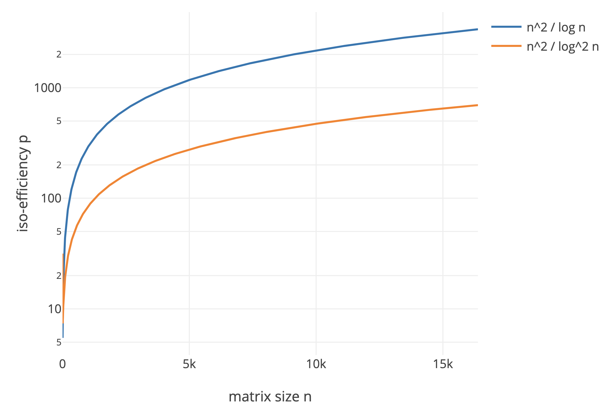

---
class: center, middle

$$ p = \Theta \left( \Big[\frac{n}{\log n}\Big]^2 \right) $$

is the right answer!

---
class: middle

In the matrix-vector algorithm we did a couple of non-trivial things:

- broadcast data inside a matrix column
- reduce inside a matrix row

---
class: center, middle

Core concept: collective comms on a subset of processors

---
class: center, middle

Groups!

Communicators!

---
class: center, middle

# Group

A group of processes used for communication

---
class: center, middle

# Communicator

Used to exchange data between processes in the same `group`

---
class: center, middle

MPI provides over 40 routines related to groups, communicators, and virtual topologies!

---
class: middle


```
int MPI_Comm_group(MPI_Comm comm, MPI_Group *group)
```
Returns group associated with communicator, e.g., `MPI_COMM_WORLD`

---
class: middle

```
int MPI_Group_incl(MPI_Group group, int p, int *ranks, MPI_Group *new_group)
```

Creates `new_group` with `p` processes.

`ranks` contains the ranks of processes to appear in `new_group`

---
class: middle

```
int MPI_Comm_create(MPI_Comm comm, MPI_Group group, MPI_Comm *new_comm)
```

New communicator based on `group`.

[mpi_group.cpp](https://github.com/stanford-cme213/stanford-cme213.github.io/blob/master/Code/Lecture_17/mpi_group.cpp)

---
class: middle

```
int ranks1[4]= {0,1,2,3}, ranks2[4]= {4,5,6,7};

MPI_Group_incl(world_group, NPROCS/2, ranks1, &sub_group[0]);
MPI_Group_incl(world_group, NPROCS/2, ranks2, &sub_group[1]);

MPI_Comm_create(MPI_COMM_WORLD, sub_group[mygroup], &sub_group_comm);

MPI_Allreduce(&sendbuf, &recvbuf, 1, MPI_INT, MPI_SUM, sub_group_comm);
```