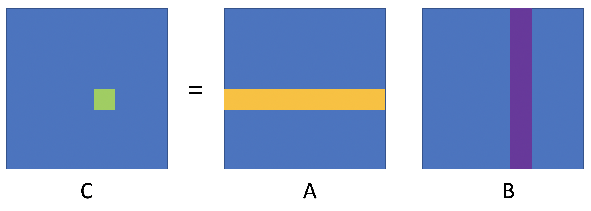
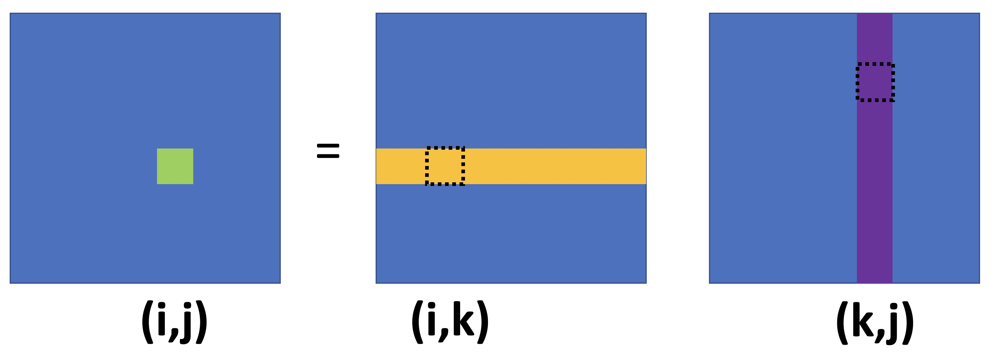
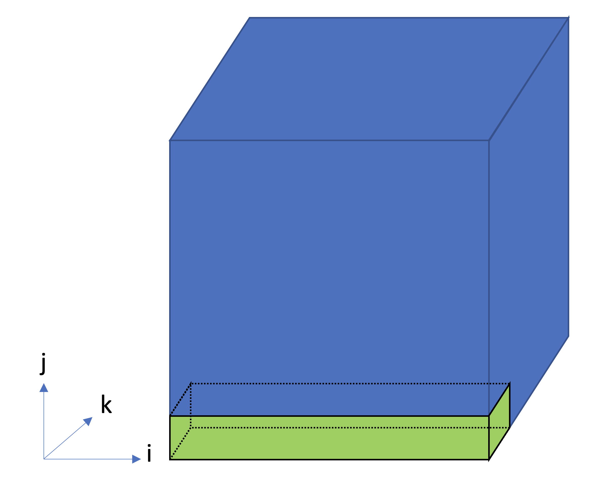

class: center, middle

# CME 213, ME 339 - Winter 2020

## Eric Darve, ICME

“When you are stuck in a traffic jam with a Porsche, all you do is burn more gas in idle. Scalability is about building wider roads, not about building faster cars.”
— Steve Swartz

---
class: center, middle

# Homework 5: matrix-matrix products

---
class: center, middle

$$c\_{ij} = \sum\_{k=1}^n a\_{ik} b\_{kj}$$

---
class: center, middle

???

Product is computed using block operations

---
class: center, middle

# Process $(i,j,k)$

---
class: center, middle

# Data distribution

Several steps are required

Assume process 0 has matrix $A$ and $B$

---
class: middle

1. Process $(0,0,0)$ sends $a\_{ij}$ and $b\_{ij}$ to process $(i,j,0)$
2. Process $(i,j,0)$ sends $a\_{ij}$ to $(i,j,j)$, and $b\_{ij}$ to $(i,j,i)$
3. $(i,j,j)$ broadcasts $a\_{ij}$ to $(i,\*,j)$, and $(i,j,i)$ broadcasts $b\_{ij}$ to $(\*,j,i)$
4. Process $(i,j,k)$ computes $a\_{ik} b\_{kj}$.
5. Reduction along $k$ axis: $(i,j,\*)$ &rarr; $(i,j,0)$
6. Send result from all $(i,j,0)$ to $(0,0,0)$.

---
class: middle

MPI functions that will be needed:

1. Scatter: `MPI_Scatterv`
2. Send/recv: `MPI_Send` and `MPI_Recv`
3. Broadcast: `MPI_Bcast`
4. Call `naive_matmul()` from `util.h`
5. Reduce: `MPI_Reduce`
6. Gather: `MPI_Gatherv`

---
class: center, middle

Scatter and broadcast are collective communications.

But only a subset of processes are involved in the communication.

---
class: middle

1. $(0,0,0)$ &rarr; $(\*,\*,0)$
2. P2P
3. $(i,k,k)$ &rarr; $(i,\*,k)$, $(k,j,k)$ &rarr; $(\*,j,k)$
4. flops
5. $(i,j,\*)$ &rarr; $(i,j,0)$
6. $(\*,\*,0)$ &rarr; $(0,0,0)$

---
class: middle

We will need two concepts:

1. MPI topology
2. MPI groups and communicators

---
class: center, middle

# MPI topology

We need a grid topology.

Arranges all processes logically on a 3D grid $(i,j,k)$.

---
class: center, middle

# Exercise

[mpi_cart.cpp](https://github.com/stanford-cme213/stanford-cme213.github.io/blob/master/Code/Lecture_18/mpi_cart.cpp)

Use the `mpi8` VM on GCP

All the files are in the [Code/Lecture_18](https://github.com/stanford-cme213/stanford-cme213.github.io/tree/master/Code/Lecture_18) folder

---
class: middle

 To dos:

- Create a 3D Cartesian topology
- Get your rank in the 3D topology
- Get your 3D coordinates $(i,j,k)$
- Get the rank of $(i,j, (k+1) \% q)$

[mpi_cart.cpp](https://github.com/stanford-cme213/stanford-cme213.github.io/blob/master/Code/Lecture_18/mpi_cart.cpp)

---
class: middle

Next step is to create sub-groups of processes for the collective communications.

We will need 4 types of sub-groups:

1. $(\*,\*,k)$ &mdash; scatter/gather
2. $(\*,j,k)$ &mdash; broadcast
3. $(i,\*,k)$ &mdash; broadcast
4. $(i,j,\*)$ &mdash; reduction

---
class: center, middle

Let's do a broadcast inside along the $i$ axis.

We need groups of the type $(\*,j,k)$.

---
class: middle

# Exercise

[mpi_cart_sub.cpp](https://github.com/stanford-cme213/stanford-cme213.github.io/blob/master/Code/Lecture_18/mpi_cart_sub.cpp)

To dos:

- Create a subgrid for all $(\*,j,k)$.
- Broadcast from rank $(0,j,k)$ to all $(\*,j,k)$.

---
class: center, middle

---
class: middle

# Exercise

[mpi_reduce.cpp](https://github.com/stanford-cme213/stanford-cme213.github.io/blob/master/Code/Lecture_18/mpi_reduce.cpp)

To dos:

- Reduce from all $(\*,j,k)$ to $(0,j,k)$.

---
class: middle

# Exercise

[mpi_send_recv.cpp](https://github.com/stanford-cme213/stanford-cme213.github.io/blob/master/Code/Lecture_18/mpi_send_recv.cpp)

To dos:

- Get coordinates of $(i,j,j)$.
- $(i,j,0)$: send to $(i,j,j)$.
- Get coordinates of $(i,j,0)$.
- $(i,j,j)$: receive from $(i,j,0)$.

---
class: middle

Final part is `MPI_Scatterv` and `MPI_Gatherv`

- $(0,0,0)$ needs to send $a\_{ij}$ and $b\_{ij}$ to $(i,j,0)$
- All $(i,j,0)$ need to send $c_{ij}$ to $(0,0,0)$.

---
class: middle

# Exercise

[mpi_send_recv.cpp](https://github.com/stanford-cme213/stanford-cme213.github.io/blob/master/Code/Lecture_18/mpi_send_recv.cpp)

To dos:

- Get coordinates of $(i,j,j)$.
- $(i,j,0)$: send to $(i,j,j)$.
- Get coordinates of $(i,j,0)$.
- $(i,j,j)$: receive from $(i,j,0)$.