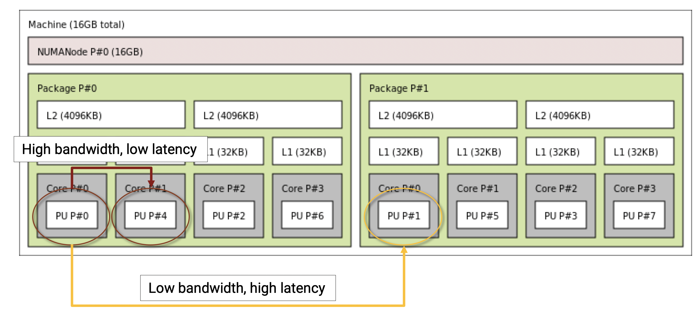
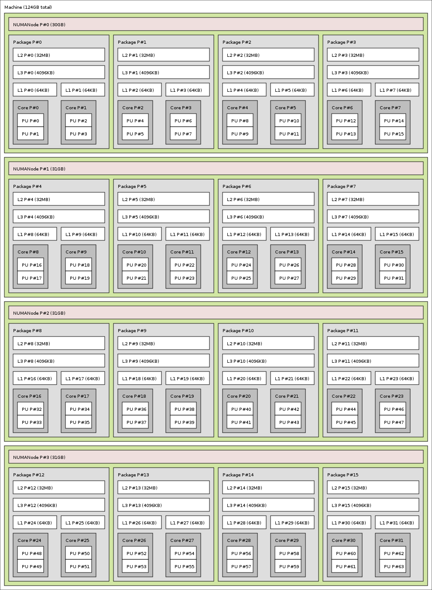
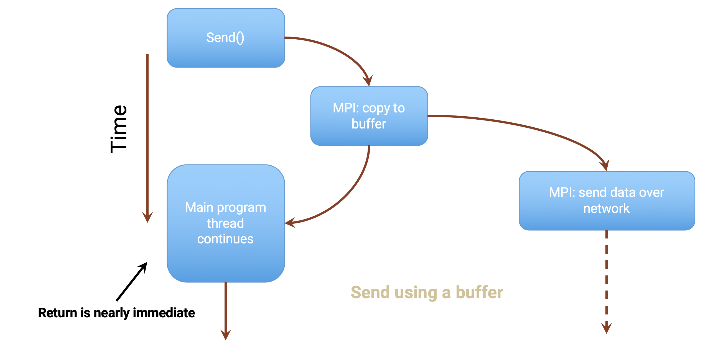
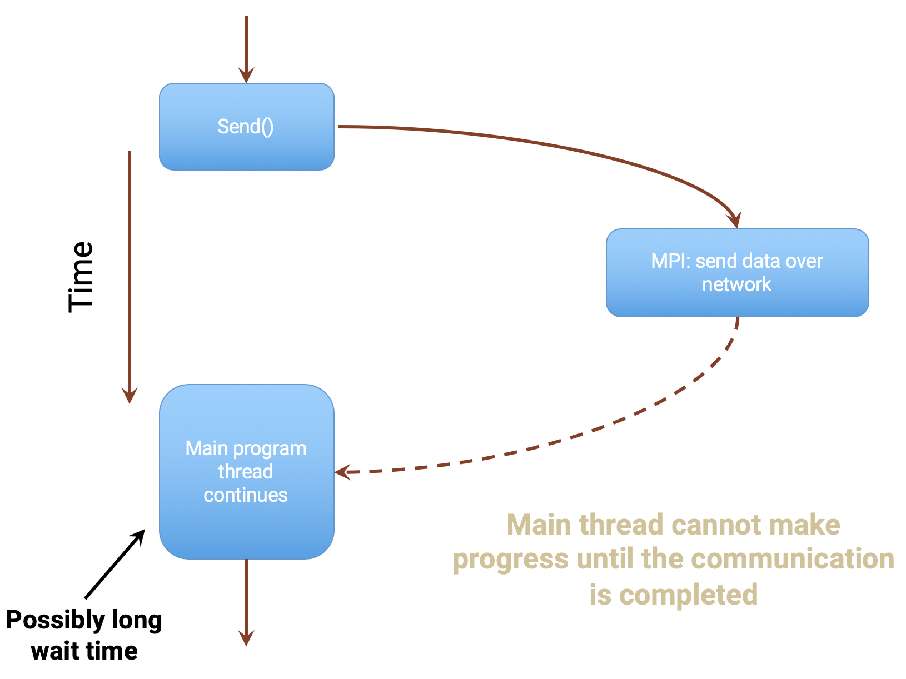
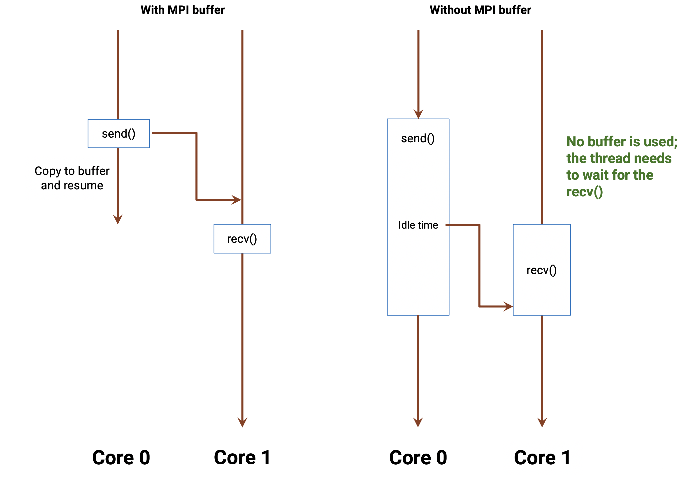
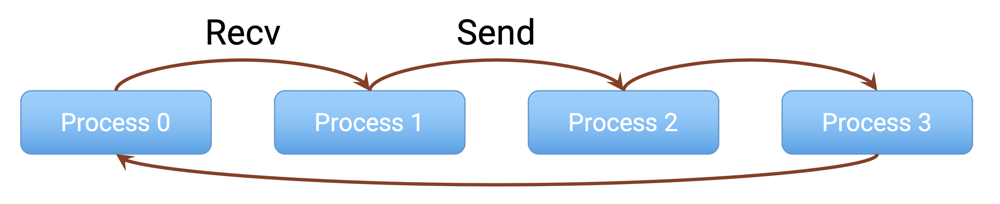
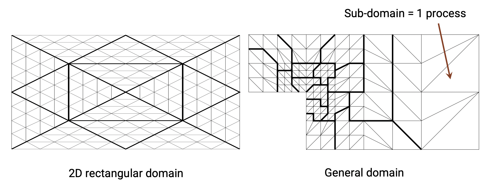
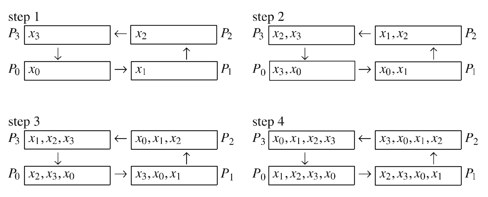

class: center, middle

# CME 213, ME 339 - Winter 2020

## Eric Darve, ICME


“Make everything as simple as possible, but not simpler.”
— Albert Einstein

---
class: center, middle

# MPI process mapping

---
class: center, middle

Mapping is important for performance

---
class: center, middle

Lots of interprocess data exchange<br>&rarr; processes should be close

Lots of memory accesses<br>&rarr; processes should be far

---
class: center, middle

Example 1: 2-package quad-core Xeon

Pre-Nehalem, with 2 dual-core dies into each package

---
class: center, middle



---
class: center, middle

Example 2: PPC64-based system with 32 cores (each with 2 hardware threads)

The architecture can get complicated real fast!

---
class: center, middle



---
class: middle

Mapping relies on two concepts:

1. Mapping: assign process to hardware component
2. Binding: restrict the motion of processes between hardware components

---
class: center, middle

# Binding

OS is responsible for assigning a hardware thread to each MPI process.

How do you control the placement of process threads?

`-bind-to object`

---
class: center, middle

This determines how the OS can migrate a process. 

Does the process stay with the same hardware thread or is it allowed to migrate to another thread (say on the same socket)?

---
class: center, middle

# `bind-to` options

Get all options using `$ mpirun -help`

---
class: center, middle

Option | Hardware element
--- | ---
`hwthread` | bind to hardware thread
`core` | bind to core
`l1cache` | bind to process on L1 cache domain
`l2cache` | bind to process on L2 cache domain
`l3cache` | bind to process on L3 cache domain

---
class: center, middle

# Continued

Option | Hardware element
--- | ---
`socket` | bind to socket
`numa` | bind to NUMA domain
`board` | bind to motherboard

---
class: center, middle

# `map-by`

`map-by object`

Skip over object between bindings.

Options:<br>
slot, hwthread, core, L1cache, L2cache, L3cache, socket, numa, board, node

---
class: center, middle

Example usage:

`mpirun -bind-to core -map-by core -np 4 ./a.out`

---
class: center, middle

# Example output of GCP

`mpi8` instance

---
class: middle

```
$ mpirun --report-bindings --oversubscribe -mca btl ^openib -n 6 \
         --bind-to hwthread --map-by hwthread ./mpi_hello
[mpi8:03807] MCW rank 0 bound to socket 0[core 0[hwt 0]]: [B./../../..]
[mpi8:03807] MCW rank 1 bound to socket 0[core 0[hwt 1]]: [.B/../../..]
[mpi8:03807] MCW rank 2 bound to socket 0[core 1[hwt 0]]: [../B./../..]
[mpi8:03807] MCW rank 3 bound to socket 0[core 1[hwt 1]]: [../.B/../..]
[mpi8:03807] MCW rank 4 bound to socket 0[core 2[hwt 0]]: [../../B./..]
[mpi8:03807] MCW rank 5 bound to socket 0[core 2[hwt 1]]: [../../.B/..]
```

---
class: middle

```
$ mpirun --report-bindings --oversubscribe -mca btl ^openib -n 6 \
         --bind-to hwthread --map-by core ./mpi_hello
[mpi8:03830] MCW rank 0 bound to socket 0[core 0[hwt 0]]: [B./../../..]
[mpi8:03830] MCW rank 1 bound to socket 0[core 1[hwt 0]]: [../B./../..]
[mpi8:03830] MCW rank 2 bound to socket 0[core 2[hwt 0]]: [../../B./..]
[mpi8:03830] MCW rank 3 bound to socket 0[core 3[hwt 0]]: [../../../B.]
[mpi8:03830] MCW rank 4 bound to socket 0[core 0[hwt 1]]: [.B/../../..]
[mpi8:03830] MCW rank 5 bound to socket 0[core 1[hwt 1]]: [../.B/../..]
```

---
class: center, middle

# More information

[Mapping, Ranking, and Binding](https://www.open-mpi.org/doc/v4.0/man1/mpirun.1.php#sect9)

---
class: center, middle

VMs on GCP are virtual so architecture is hidden.

It can be queried using:

`lstopo`

`hwloc-info`

---
class: middle

```
$ lstopo
Machine (7165MB)
  Package L#0 + L3 L#0 (55MB)
    L2 L#0 (256KB) + L1d L#0 (32KB) + L1i L#0 (32KB) + Core L#0
      PU L#0 (P#0)
      PU L#1 (P#4)
    L2 L#1 (256KB) + L1d L#1 (32KB) + L1i L#1 (32KB) + Core L#1
      PU L#2 (P#1)
      PU L#3 (P#5)
    L2 L#2 (256KB) + L1d L#2 (32KB) + L1i L#2 (32KB) + Core L#2
      PU L#4 (P#2)
      PU L#5 (P#6)
    L2 L#3 (256KB) + L1d L#3 (32KB) + L1i L#3 (32KB) + Core L#3
      PU L#6 (P#3)
      PU L#7 (P#7)
  HostBridge L#0
    PCI 1af4:1000
```

---
class: middle

```
$ hwloc-info
depth 0:	1 Machine (type #1)
 depth 1:	1 Package (type #3)
  depth 2:	1 L3Cache (type #4)
   depth 3:	4 L2Cache (type #4)
    depth 4:	4 L1dCache (type #4)
     depth 5:	4 L1iCache (type #4)
      depth 6:	4 Core (type #5)
       depth 7:	8 PU (type #6)
Special depth -3:	1 Bridge (type #9)
Special depth -4:	1 PCI Device (type #10)
```

---
class: center, middle

# More information

[Hwloc tutorial slides](https://www-lb.open-mpi.org/projects/hwloc/tutorials/20160606-PATC-hwloc-tutorial.pdf)

[Open-mpi hwloc documentation page](https://www-lb.open-mpi.org/projects/hwloc/)

[Hwloc/lstopo examples](https://www.open-mpi.org/projects/hwloc/doc/v2.1.0/a00328.php#cli_examples)

---
class: middle

# MPI communications

Two strategies:

1. Buffered: send/receive appear to complete immediately
2. Non-buffered: saves memory but requires waiting

---
class: center, middle



---
class: center, middle



---
class: center, middle

# Summary send/recv with buffering

---
class: middle

# `Send`

If MPI uses a separate system buffer, the data in `smessage` (user buffer space) is copied (fast); then the main thread resumes.

If MPI does not use a separate system buffer, the main thread must wait until the communication over the network is complete.

---
class: middle

# `Recv`

If communication happens before the call, the data is stored in an MPI system buffer, and then simply copied into the user provided rmessage when `recv()` is called.

The user cannot decide whether a buffer is used or not; the MPI library makes that decision based on the resources available and other factors.

---
class: center, middle



---
class: center, middle

# Send/Recv deadlocks

---
class: center, middle

Very easy to achieve with Send/Recv

Send and Recv are both blocking

Process will wait until communication completes

---
class: center, middle

Process 0 | Process 1 | Deadlock
--- | --- | ---
Recv()<br>Send() | Recv()<br>Send() | .red[Always]
Send()<br>Recv() | Send()<br>Recv() | Depends on whether a buffer is used or not
Send()<br>Recv() | Recv()<br>Send() | .green[Secure]

---
class: center, middle

Let's demonstrate these implementations on a ring communication example

---
class: center, middle



---
class: center, middle

# Deadlock

[ring deadlock code](https://github.com/stanford-cme213/stanford-cme213.github.io/blob/master/Code/Lecture_19/ring_DL.c)

---
class: middle

```
...
MPI_Recv(&number_recv, 1, MPI_INT, rank_sender,
            0, MPI_COMM_WORLD, MPI_STATUS_IGNORE);
MPI_Send(&number_send, 1, MPI_INT, rank_receiver,
            0, MPI_COMM_WORLD);
...            
```      

---
class: middle

# Uncertain case

[non-secure code](https://github.com/stanford-cme213/stanford-cme213.github.io/blob/master/Code/Lecture_19/ring_NS.c)

```
...
MPI_Send(&number_send, 1, MPI_INT, rank_receiver,
            0, MPI_COMM_WORLD);
MPI_Recv(&number_recv, 1, MPI_INT, rank_sender,
            0, MPI_COMM_WORLD, MPI_STATUS_IGNORE);
...            
```

---
class: center, middle

# Correct implementation

[secure implementation code](https://github.com/stanford-cme213/stanford-cme213.github.io/blob/master/Code/Lecture_19/ring_SEC.c)

---
class: middle

```
if (rank % 2 == 0) {
    MPI_Send(&number_send, 1, MPI_INT, rank_receiver,
                0, MPI_COMM_WORLD);
} else {
    MPI_Recv(&number_recv, 1, MPI_INT, rank_sender,
                0, MPI_COMM_WORLD, MPI_STATUS_IGNORE);
}

if (rank % 2 == 1){
    MPI_Send(&number_send, 1, MPI_INT, rank_receiver,
                0, MPI_COMM_WORLD);
} else {
    MPI_Recv(&number_recv, 1, MPI_INT, rank_sender,
                0, MPI_COMM_WORLD, MPI_STATUS_IGNORE);
}
```

---
class: center, middle

# Non-blocking MPI communications

---
class: center, middle

# Blocking

What we have seen so far

Process waits until MPI command completes

---
class: middle

# Advantages

- Simple to use.
- Issue command; once code returns, you know that the task is done (at least the resource is usable).
- Efficient.

However, this is too restrictive.

---
class: middle

When communications are happening, you probably want to do something else, such as do some useful computation or issue other communications. 

This is called overlapping communication and computation.

---
class: middle

More generally, instead of blocking and wait for some data to perform the next task, you want to work on all the tasks for which data is available.

Then, check periodically for status of communication.

---
class: middle

Non-blocking communications are also safer and help avoid deadlocks.

---
class: middle

# How to use non-blocking communications

[MPI_Isend](https://www.open-mpi.org/doc/v4.0/man3/MPI_Isend.3.php)

[MPI_Irecv](https://www.open-mpi.org/doc/v4.0/man3/MPI_Irecv.3.php)

[MPI_Test](https://www.open-mpi.org/doc/v4.0/man3/MPI_Test.3.php) and [MPI_Wait](https://www.open-mpi.org/doc/v4.0/man3/MPI_Wait.3.php)

---
class: center, middle

# Motivating example



???

- Explain how deadlock can easily occur in this setting
- Instead explain how non-blocking communication can be used to manage all messages

---
class: center, middle

# Gather ring example

---
class: center, middle



---
class: center, middle

[gather_ring.cpp](https://github.com/stanford-cme213/stanford-cme213.github.io/blob/master/Code/Lecture_19/gather_ring.cpp)

---
class: middle

```
vector<MPI_Request> send_req(nproc - 1);
for (int i = 0; i < nproc - 1; ++i) {
    // Send to the right: Isend
    int *p_send = &numbers[(rank - i + nproc) % nproc];
    MPI_Isend(p_send, 1, MPI_INT, rank_receiver, 0, MPI_COMM_WORLD, 
              &send_req[i]);
    // We can proceed; no need to wait now.
    // Receive from the left: Recv
    int *p_recv = &numbers[(rank - i - 1 + nproc) % nproc];
    MPI_Recv(p_recv, 1, MPI_INT, rank_sender, 0, 
             MPI_COMM_WORLD, MPI_STATUS_IGNORE);
    // We need to wait; we cannot move forward until we have that data.
}
```

---
class: center, middle

# The key MPI routines

---
class: middle

```
int MPI_Isend(void* buf, int count,
    MPI_Datatype datatype,
    int dest, int tag,
    MPI_Comm comm, MPI_Request *request)
```    

`MPI_Request*` used to get information later on about the status of that operation.

[MPI_Isend](https://www.open-mpi.org/doc/v4.0/man3/MPI_Isend.3.php)

---
class: middle

```
int MPI_Irecv(void* buf, int count,
	MPI_Datatype datatype,
	int source, int tag,
	MPI_Comm comm, MPI_Request *request)
```

[MPI_Irecv](https://www.open-mpi.org/doc/v4.0/man3/MPI_Irecv.3.php)

---
class: middle

```
int MPI_Test(MPI_Request *request, int *flag,
	MPI_Status *status)
```

`flag` True if operation completed (logical)

[MPI_Test](https://www.open-mpi.org/doc/v4.0/man3/MPI_Test.3.php)

---
class: middle

```
int MPI_Wait(MPI_Request *request, MPI_Status *status)
```

Waits for an MPI send or receive to complete

[MPI_Wait](https://www.open-mpi.org/doc/v4.0/man3/MPI_Wait.3.php)

---
class: center, middle

# MPI send modes

Optimization!


---
class: middle

Three main algorithmic variants:

1. `Buffered` MPI uses a buffer to avoid blocking
2. `Eager` MPI will try to send data immediately whether or not a `Recv` has been posted. Works well for small messages.
3. `Rendez-vous` Send data only when `Recv` has been posted; buffering is not needed; requires a synchronization of the two processes

---
class: middle

# MPI standard Send

[MPI_Send](https://www.open-mpi.org/doc/v4.0/man3/MPI_Send.3.php)

Message size | Strategy
--- | ---
Small messages | eager
Large messages | rendez-vous

User has no control

---
class: middle

# Bsend

Send with user-specified buffering &#124;
[MPI_Bsend](https://www.open-mpi.org/doc/v4.0/man3/MPI_Bsend.3.php)

```
int MPI_Bsend(const void *buf, int count, MPI_Datatype datatype,
    int dest, int tag, MPI_Comm comm)
```

Allows the user to send messages without worrying about whether they are buffered.

The user must have provided buffer space using [MPI_Buffer_attach(void *buf, int size)](https://www.open-mpi.org/doc/v4.0/man3/MPI_Buffer_attach.3.php)

---
class: middle

# Ssend

Synchronous send; `rendez-vous` &#124;
[MPI_Ssend](https://www.open-mpi.org/doc/v4.0/man3/MPI_Ssend.3.php)

```
int MPI_Ssend(const void *buf, int count, MPI_Datatype datatype, int dest,
    int tag, MPI_Comm comm)
```

Blocks until buffer in sending task is free for reuse **and** destination process has started to receive message.

Can be used to detect potential deadlocks hidden by MPI buffering

---
class: middle

# Rsend

Ready send; `eager` &#124;
[MPI_Rsend](https://www.open-mpi.org/doc/v4.0/man3/MPI_Rsend.3.php)

```
int MPI_Rsend(const void *buf, int count, MPI_Datatype datatype, int dest,
    int tag, MPI_Comm comm)
```

A ready send may only be called if the user can guarantee that a receive is already posted. 

It is an error if the receive is not posted before the ready send is called.

---
class: center, middle

Send Modes | MPI function | Completion Condition
--- | --- | ---
Standard send | `MPI_Send` | Message sent (receiver state unknown)
Buffered send | `MPI_Bsend` | Always completes, irrespective of the receiver
Synchronous send | `MPI_Ssend` | Only completes when the receive has completed
Ready send | `MPI_Rsend` | May be used only when the matching receive has already been posted

---
class: middle

# Useful resources

- [LLNL tutorial](https://computing.llnl.gov/tutorials/mpi/)
- [LLNL MPI performance](https://computing.llnl.gov/tutorials/mpi_performance/)
- [MPI standard version 3.1](https://www.mpi-forum.org/docs/mpi-3.1/mpi31-report.pdf)
- [Open MPI documentation](https://www.open-mpi.org/doc/v4.0/)