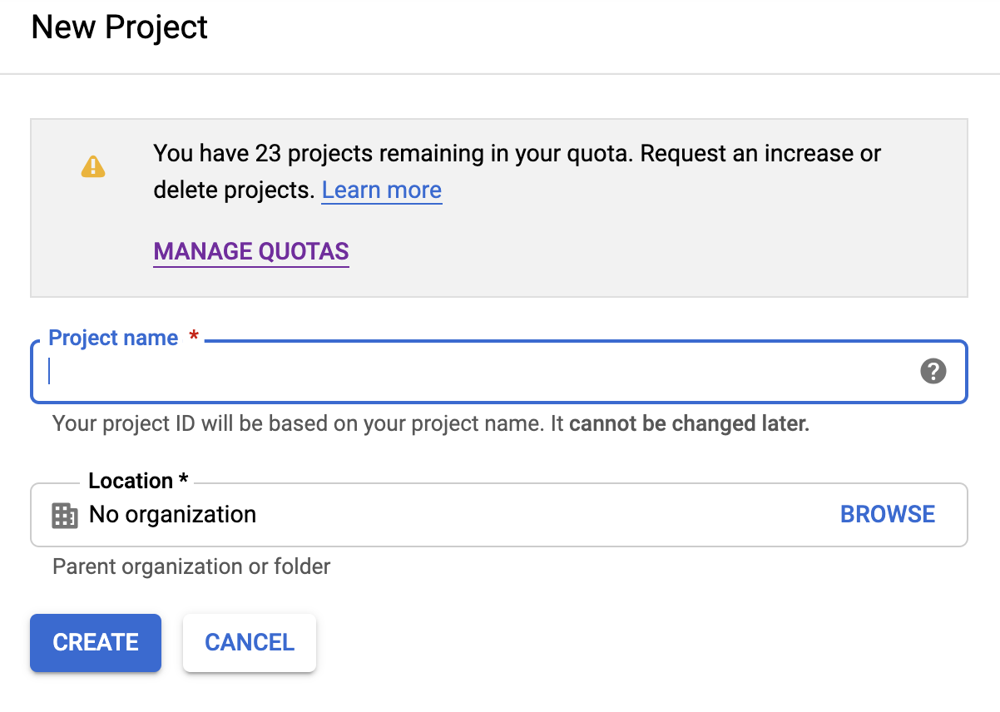
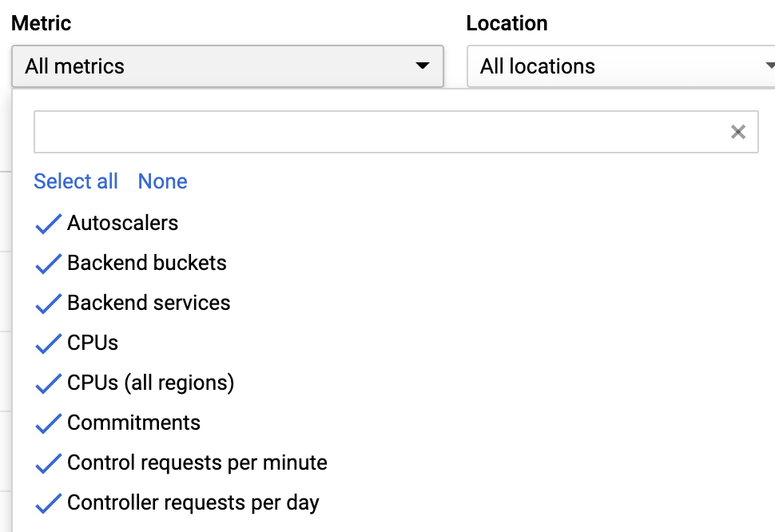
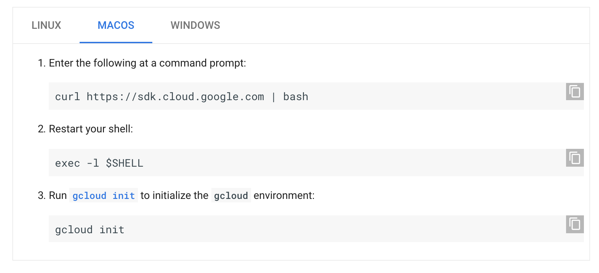

## Cheat sheet

[Compute Page](https://console.cloud.google.com/compute/)

[Billing page](https://console.cloud.google.com/billing)

`gcloud compute instances start NAME`

`gcloud compute ssh NAME`

`gcloud compute scp LOCAL_PATH NAME:VM_PATH`

`gcloud compute scp NAME:VM_PATH LOCAL_PATH`

`gcloud compute scp --recurse` to copy directories

`gcloud compute instances stop NAME`

For remote editing with VS Code:

`gcloud compute ssh NAME --ssh-flag="-R 52698:localhost:52698"`

`rmate FILENAME`

## Before You Start
---

- Use a **non-Stanford Google account.**
- Redeem your GCP credits provided by the course.  
- Google and Canvas are always helpful.

## Prepare your Google Cloud Platform account
---

### Create a new project named cme-213 (or any name you prefer)

You can create and manage your GCP projects on the [Resource Management Page](https://console.cloud.google.com/cloud-resource-manager).

Click on "CREATE PROJECT" at the top:



Do not click on `Manage Quotas`. Enter a project name and click `Create`.

### [hw3 and after] Request GPU quotas

This step is not needed for hw1 and hw2, but is required to be able to reserve GPUs. You will need to **wait a few hours** before doing this step after creating a new project. It takes time for the web interface to populate all the required quota options.

To use GPUs, Google Cloud Platform requires you to request **GPU quotas**. Quota requests have to be done through the [quota page](https://console.cloud.google.com/iam-admin/quotas). Make sure you have the right project selected (it's shown at the top)


My project is called `CME213 Spring 2019`.

You need two types of quotas for this the course:
* `GPUs (all regions)`
* `NVIDIA K80 GPUs` at location `us-west1` and you need at least **4** for both of them.

If you do not see these quotas, you may need to enable the Compute Engine API. To do this, find "APIs & Services" and
go to Library. In the search bar, search for "Compute Engine API", and click Enable. Wait for the operation to complete,
and you should see the `GPUs (all regions)` and `NVIDIA K80 GPUs` quotas popup.

There are ~ 770 different quotas to choose from. To help you find the correct ones, click on Metric from the [quota page](https://console.cloud.google.com/iam-admin/quotas):



then select `None` and in the search bar enter `GPU`. Select `GPUs (all regions)` and `NVIDIA K80 GPUs`. Note: if you do not see the GPU options, it means that you need to wait a little longer for quotas to be populated.

Then, click on the drop-down box under `Location` and select `Global` and `us-west1`.

You will find the two quotas needed for the course appearing on the page. Select both of them. Make sure you have the right ones!

You should get this:


Click `EDIT QUOTAS` button on top of the page. Fill the quota request form to request at least 4 quotas for both items.

You will not be charged for requesting quotas. It can take up to 48 hours to process your request, so we suggest requesting your quotas as early as possible.

## Install Google Cloud SDK on your local machine
---
Google Cloud SDK (`gcloud`) is a software package that allows you to manage your GCP projects from your local machine through terminals.
We are going to use `gcloud` to run scripts that will create the correct virtual machines for you.

`gcloud` can be installed on a variety of operating systems. [Installation procedures](https://cloud.google.com/sdk/docs/downloads-interactive) are provided for all platforms.



## Manage your virtual machines
---

Each virtual machine can be configured with access to different resources, for example multicore CPU only, or 1 GPU, or 4 GPUs. When a VM is created, you can install different software (compilers, libraries, etc) as needed. For simplicity, we provide scripts for each homework that will create an appropriate VM specific to this homework. The script is named `./create_vm.sh` and can be found in the directory `starter_code` for each homework.

Additional scripts can be found under `Code/`. For example, [create_vm_openmp.sh](Code/create_vm_openmp.sh) creates a multicore VM suitable to test openmp. When running this script you will get the following output:

```
$ ./create_vm_openmp.sh 
Updated property [compute/zone].
Created [https://www.googleapis.com/compute/v1/projects/cme213-winter-2020/zones/us-west1-b/instances/omp].
NAME  ZONE        MACHINE_TYPE   PREEMPTIBLE  INTERNAL_IP  EXTERNAL_IP   STATUS
omp   us-west1-b  n1-highcpu-8               10.138.0.5   34.82.44.63  RUNNING
Installing necessary libraries. You will be able to log into the VM after several minutes with:
gcloud compute ssh omp
```

This VM is running Linux with Ubuntu. Any package working under Ubuntu can be installed on the VM.

This script is similar to the one used for `hw2`.

Note that as soon as you run the script the instance is created and is running. **Billing has started!!!** 

You can check and manage your instances on the [VM instances](https://console.cloud.google.com/compute/instances) page. You can stop your instance there. But wait a few minutes that the software has finished installing.

### Create your virtual machine for homework assignments

The general process to create a virtual machine for a homework is:

1. Start a terminal
2. `cd` to your starter code directory for the corresponding homework.
3. Run `./create_vm.sh`

You will see something like this if success
```
Updated property [compute/zone].
Created [https://www.googleapis.com/compute/v1/projects/cme-213/zones/us-west1-b/instances/hw2].
NAME  ZONE        MACHINE_TYPE  PREEMPTIBLE  INTERNAL_IP  EXTERNAL_IP    STATUS
hw2   us-west1-b  n1-highcpu-8               10.138.0.24  35.197.115.51  RUNNING
Installing necessary libraries. You will be able to log into the VM after several minutes with:
gcloud compute ssh hw2
```

You should remember the name of your VM (`hw2` in this case) and use it for `NAME` in the commands below.

### Start your virtual machine
Your virtual machine should start automatically after you created it. However you will need to manually start your machine if you stopped it.  

To start a virtual machine:
1. Start a terminal
2. Run `gcloud compute instances start NAME`

or through [Compute Page](https://console.cloud.google.com/compute/).


**Billing starts now!!!**

From the [Compute Page](https://console.cloud.google.com/compute/), you can start, stop your instance and check its current status.

### Log into your virtual machine
You can only log into your VM after it is started.

To log into your virtual machine
1. Start a terminal
2. Run `gcloud compute ssh NAME`

or through [Compute Page](https://console.cloud.google.com/compute/). Click on SSH


You might need to wait for a while if you see the following message. It's likely we are installing necessary packages for the homework/project; while this is happening ssh is disabled.

```
ssh: connect to host XX.XX.XX.XXX port 22: Connection refused
ERROR: (gcloud.compute.ssh) [/usr/bin/ssh] exited with return code [255].
```

### Stop your virtual machine
We manage to setup an auto-shutdown service on your VMs through `create_vm.sh`. It will automatically stop your VM after 30 minutes of disconnection. However
it won't work if you use tools that keep you logged in, like `tmux` or `screen`. So
**Stop your VM when you are not using it!!!**

To stop your virtual machine
1. Start a terminal
2. Run `gcloud compute instances stop NAME`

or through [Compute Page](https://console.cloud.google.com/compute/).

### Delete your virtual machine
Your don't usually need to delete virtual machines --- you only need to stop them. However if you mess things up you can always start over by deleting and recreating your virtual machine.

To delete your virtual machine
1. Start a terminal
2. Run `gcloud compute instances delete NAME`

or through [Compute Page](https://console.cloud.google.com/compute/).

### Transfer files between local machine and VMs
It is recommended to use `scp` to transfer files to/from your virtual machine:

To transfer to your VM:
1. Start a terminal
2. Run `gcloud compute scp LOCAL_PATH NAME:VM_PATH`, where `LOCAL_PATH` is the path to your local file and `VM_PATH` is the VM destination your file will appear. Remember that NAME is the name of your instance, e.g., `hw2`.

To transfer from your VM:
1. Start a terminal
2. Run `gcloud compute scp NAME:VM_PATH LOCAL_PATH`, where `VM_PATH` is the path of file on your VM and `LOCAL_PATH` is the local destination. Remember that NAME is the name of your instance, e.g., `hw2`.

You can use `--recurse` flag to transfer a directory. For example:  
`gcloud compute scp --recurse ./starter_code hw2:~/`  
will transfer the local `starter_code` folder to your hw2 virtual machine.

<!-- ### About user names

There is a small bug in the way Google Cloud is configured which in some cases may lead to multiple users being defined in your VM. You can spot this by listing the content of `/home`:


Chances are you may not even notice this but if you do not see your files you may simply be in the wrong directory. -->

### Other helpful commands
`gcloud` is powerful and allows you to do about anything about your cloud platform. Here are some useful commands:
* `gcloud compute instances list` will list all of your VMs
* `gcloud compute instances reset NAME` will reset your VM (should be equivalent as delete then create)
* `gcloud compute --help` will show help for `gcloud compute`

Remember you can always manage your VMs from the [Compute Page](https://console.cloud.google.com/compute/) if you are not comfortable with command line tools.

### Keep a mind on your credits
You can see how you are doing with your credits on the [Billing Page](https://console.cloud.google.com/billing/).

Here we provide a table of specs for each type of virtual machine used for homework and project:

|             | CPU cores | Memory     | GPU type    | GPU number  | Hourly cost |
| ---------   | :-------: | :--------: | :---------: | :---------: | :---------: |
| OMP 8 cores | 8         | 7.2GB      | -           | -           | $0.2836     |
| HW3         | 2         | 7.5GB      | NVIDIA K80  | 1           | $0.383      |


## Remote Editor
---
If you are comfortable with command-line editors like `vim` or `emacs`, you can edit your files remotely in the cloud. If you do not want to use these remote editors, you typically have to manually sync between your local copy and the remote one.

We will explain how to setup [VS Code](https://code.visualstudio.com/) (not to be confused with Visual Studio by Microsoft) using a special extension to help you edit your remote files locally. We provide a brief tutorial below on how to setup your remote editor. It is **not required** to use VS Code for course homework or project.

### Download VS Code and install Remote VSCode extension

VS Code can be downloaded from its [official website](https://code.visualstudio.com/). You will need the [Remote VSCode extension](https://marketplace.visualstudio.com/items?itemName=rafaelmaiolla.remote-vscode). Installation should be straightforward.

### Start VS Code server

1. Open VS Code.
2. Start the server in the command palette - Press `F1` and type `Remote: Start server`, and press `ENTER` to start the server. You may see a Starting server at the status bar in the bottom.

### Open a remote file

1. Make sure your VS Code server is running.
2. Start a terminal.
3. Connect to your VM with: `gcloud compute ssh NAME --ssh-flag="-R 52698:localhost:52698"`. Remember to replace NAME by the name of your instance.
4. Run `rmate FILENAME` **on your VM,** where `FILENAME` is path to the file you want to edit. `rmate` should be already installed in your VM.
5. Magically, find your remote file opened in VS Code.

Note:
* You can repeat step 4 to open multiple files concurrently.
* Make sure to save and close your file before disconnecting your VM.

This will greatly simplify the process of reading and modifying source files in the cloud. You now have access to all the functionalities of VS Code without worrying about a slow network connection.

### Administrative links and info

* [Machine types](https://cloud.google.com/compute/docs/machine-types)
* [Instance pricing](https://cloud.google.com/compute/vm-instance-pricing)
* [VM images](https://cloud.google.com/compute/docs/images)